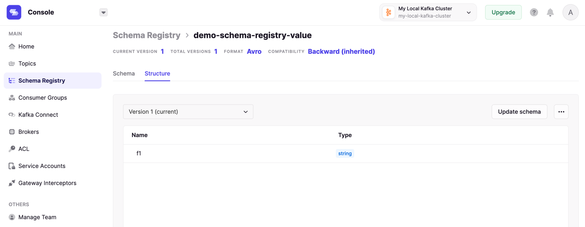
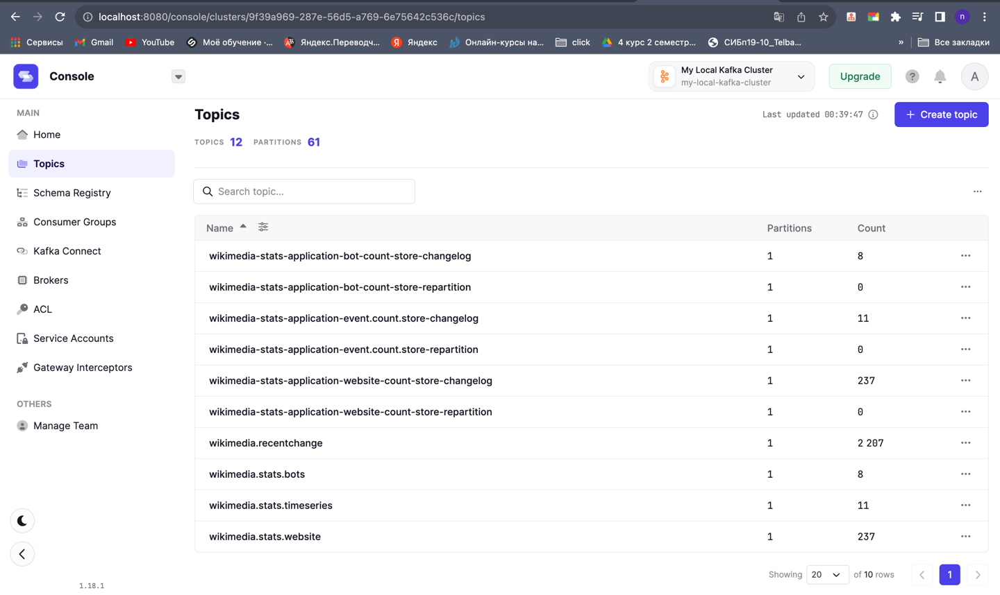

# Elasticsearch Service Sink Connector
- установите зип https://docs.confluent.io/kafka-connectors/elasticsearch/current/overview.html
- установите .jar https://github.com/conduktor/kafka-connect-wikimedia/releases

```properties
#connector/connect-standalone.properties
key.converter=org.apache.kafka.connect.json.JsonConverter
value.converter=org.apache.kafka.connect.json.JsonConverter
key.converter.schemas.enable=true
offset.flush.interval.ms=1000

bootstrap.servers=localhost:9092
offset.storage.file.filename=/tmp/connect.offsets
plugin.path=/opt/homebrew/Cellar/kafka/3.4.0/connectors
```

```properties
#connector/wikimedia.properties
name=wikimedia-source-connector
tasks.max=1
connector.class=io.conduktor.demos.kafka.connect.wikimedia.WikimediaConnector
topic=wikimedia.recentchange.connect
url=https://stream.wikimedia.org/v2/stream/recentchange
errors.tollerance=all
errors.deadletterqueue.topic.name=wikimedia.connect.dlq
```



### Run

```bash
pwd
# /opt/homebrew/Cellar/kafka/3.4.0/connectors
connectors % connect-standalone config/connect-standalone.properties config/wikimedia.properties
# this will run Kafka Connect
```
```log
[2023-11-17 22:32:39,344] INFO Kafka Connect standalone worker initializing ... (org.apache.kafka.connect.cli.ConnectStandalone:68)
[2023-11-17 22:32:39,348] INFO WorkerInfo values: 
	jvm.args = -Xms256M, -Xmx2G, -XX:+UseG1GC, -XX:MaxGCPauseMillis=20, -XX:InitiatingHeapOccupancyPercent=35, -XX:+ExplicitGCInvokesConcurrent, -XX:MaxInlineLevel=15, -Djava.awt.headless=true, -Dcom.sun.management.jmxremote, -Dcom.sun.management.jmxremote.authenticate=false, -Dcom.sun.management.jmxremote.ssl=false, -Dkafka.logs.dir=/opt/homebrew/Cellar/kafka/3.4.0/libexec/bin/../logs, -Dlog4j.configuration=file:/opt/homebrew/Cellar/kafka/3.4.0/libexec/bin/../config/connect-log4j.properties
	jvm.spec = Homebrew, OpenJDK 64-Bit Server VM, 20.0.1, 20.0.1
	jvm.classpath = /opt/homebrew/Cellar/kafka/3.4.0/libexec/bin/../libs/activation-1.1.1.jar:/opt/homebrew/Cellar/kafka/3.4.0/libexec/bin/../libs/aopalliance-repackaged-2.6.1.jar:/opt/homebrew/Cellar/kafka/3.4.0/libexec/bin/../libs/argparse4j-0.7.0.jar:/opt/homebrew/Cellar/kafka/3.4.0/libexec/bin/../libs/audience-annotations-0.5.0.jar:/opt/homebrew/Cellar/kafka/3.4.0/libexec/bin/../libs/commons-cli-1.4.jar:/opt/homebrew/Cellar/kafka/3.4.0/libexec/bin/../libs/commons-lang3-3.8.1.jar:/opt/homebrew/Cellar/kafka/3.4.0/libexec/bin/../libs/connect-api-3.4.0.jar:/opt/homebrew/Cellar/kafka/3.4.0/libexec/bin/../libs/connect-basic-auth-extension-3.4.0.jar:/opt/homebrew/Cellar/kafka/3.4.0/libexec/bin/../libs/connect-json-3.4.0.jar:/opt/homebrew/Cellar/kafka/3.4.0/libexec/bin/../libs/connect-mirror-3.4.0.jar:/opt/homebrew/Cellar/kafka/3.4.0/libexec/bin/../libs/connect-mirror-client-3.4.0.jar:/opt/homebrew/Cellar/kafka/3.4.0/libexec/bin/../libs/connect-runtime-3.4.0.jar:/opt/homebrew/Cellar/kafka/3.4.0/libexec/bin/../libs/connect-transforms-3.4.0.jar:/opt/homebrew/Cellar/kafka/3.4.0/libexec/bin/../libs/hk2-api-2.6.1.jar:/opt/homebrew/Cellar/kafka/3.4.0/libexec/bin/../libs/hk2-locator-2.6.1.jar:/opt/homebrew/Cellar/kafka/3.4.0/libexec/bin/../libs/hk2-utils-2.6.1.jar:/opt/homebrew/Cellar/kafka/3.4.0/libexec/bin/../libs/jackson-annotations-2.13.4.jar:/opt/homebrew/Cellar/kafka/3.4.0/libexec/bin/../libs/jackson-core-2.13.4.jar:/opt/homebrew/Cellar/kafka/3.4.0/libexec/bin/../libs/jackson-databind-2.13.4.2.jar:/opt/homebrew/Cellar/kafka/3.4.0/libexec/bin/../libs/jackson-dataformat-csv-2.13.4.jar:/opt/homebrew/Cellar/kafka/3.4.0/libexec/bin/../libs/jackson-datatype-jdk8-2.13.4.jar:/opt/homebrew/Cellar/kafka/3.4.0/libexec/bin/../libs/jackson-jaxrs-base-2.13.4.jar:/opt/homebrew/Cellar/kafka/3.4.0/libexec/bin/../libs/jackson-jaxrs-json-provider-2.13.4.jar:/opt/homebrew/Cellar/kafka/3.4.0/libexec/bin/../libs/jackson-module-jaxb-annotations-2.13.4.jar:/opt/homebrew/Cellar/kafka/3.4.0/libexec/bin/../libs/jackson-module-scala_2.13-2.13.4.jar:/opt/homebrew/Cellar/kafka/3.4.0/libexec/bin/../libs/jakarta.activation-api-1.2.2.jar:/opt/homebrew/Cellar/kafka/3.4.0/libexec/bin/../libs/jakarta.annotation-api-1.3.5.jar:/opt/homebrew/Cellar/kafka/3.4.0/libexec/bin/../libs/jakarta.inject-2.6.1.jar:/opt/homebrew/Cellar/kafka/3.4.0/libexec/bin/../libs/jakarta.validation-api-2.0.2.jar:/opt/homebrew/Cellar/kafka/3.4.0/libexec/bin/../libs/jakarta.ws.rs-api-2.1.6.jar:/opt/homebrew/Cellar/kafka/3.4.0/libexec/bin/../libs/jakarta.xml.bind-api-2.3.3.jar:/opt/homebrew/Cellar/kafka/3.4.0/libexec/bin/../libs/javassist-3.27.0-GA.jar:/opt/homebrew/Cellar/kafka/3.4.0/libexec/bin/../libs/javax.annotation-api-1.3.2.jar:/opt/homebrew/Cellar/kafka/3.4.0/libexec/bin/../libs/javax.servlet-api-3.1.0.jar:/opt/homebrew/Cellar/kafka/3.4.0/libexec/bin/../libs/javax.ws.rs-api-2.1.1.jar:/opt/homebrew/Cellar/kafka/3.4.0/libexec/bin/../libs/jaxb-api-2.3.0.jar:/opt/homebrew/Cellar/kafka/3.4.0/libexec/bin/../libs/jersey-client-2.34.jar:/opt/homebrew/Cellar/kafka/3.4.0/libexec/bin/../libs/jersey-common-2.34.jar:/opt/homebrew/Cellar/kafka/3.4.0/libexec/bin/../libs/jersey-container-servlet-2.34.jar:/opt/homebrew/Cellar/kafka/3.4.0/libexec/bin/../libs/jersey-container-servlet-core-2.34.jar:/opt/homebrew/Cellar/kafka/3.4.0/libexec/bin/../libs/jersey-hk2-2.34.jar:/opt/homebrew/Cellar/kafka/3.4.0/libexec/bin/../libs/jersey-server-2.34.jar:/opt/homebrew/Cellar/kafka/3.4.0/libexec/bin/../libs/jetty-client-9.4.48.v20220622.jar:/opt/homebrew/Cellar/kafka/3.4.0/libexec/bin/../libs/jetty-continuation-9.4.48.v20220622.jar:/opt/homebrew/Cellar/kafka/3.4.0/libexec/bin/../libs/jetty-http-9.4.48.v20220622.jar:/opt/homebrew/Cellar/kafka/3.4.0/libexec/bin/../libs/jetty-io-9.4.48.v20220622.jar:/opt/homebrew/Cellar/kafka/3.4.0/libexec/bin/../libs/jetty-security-9.4.48.v20220622.jar:/opt/homebrew/Cellar/kafka/3.4.0/libexec/bin/../libs/jetty-server-9.4.48.v20220622.jar:/opt/homebrew/Cellar/kafka/3.4.0/libexec/bin/../libs/jetty-servlet-9.4.48.v20220622.jar:/opt/homebrew/Cellar/kafka/3.4.0/libexec/bin/../libs/jetty-servlets-9.4.48.v20220622.jar:/opt/homebrew/Cellar/kafka/3.4.0/libexec/bin/../libs/jetty-util-9.4.48.v20220622.jar:/opt/homebrew/Cellar/kafka/3.4.0/libexec/bin/../libs/jetty-util-ajax-9.4.48.v20220622.jar:/opt/homebrew/Cellar/kafka/3.4.0/libexec/bin/../libs/jline-3.21.0.jar:/opt/homebrew/Cellar/kafka/3.4.0/libexec/bin/../libs/jopt-simple-5.0.4.jar:/opt/homebrew/Cellar/kafka/3.4.0/libexec/bin/../libs/jose4j-0.7.9.jar:/opt/homebrew/Cellar/kafka/3.4.0/libexec/bin/../libs/kafka-clients-3.4.0.jar:/opt/homebrew/Cellar/kafka/3.4.0/libexec/bin/../libs/kafka-group-coordinator-3.4.0.jar:/opt/homebrew/Cellar/kafka/3.4.0/libexec/bin/../libs/kafka-log4j-appender-3.4.0.jar:/opt/homebrew/Cellar/kafka/3.4.0/libexec/bin/../libs/kafka-metadata-3.4.0.jar:/opt/homebrew/Cellar/kafka/3.4.0/libexec/bin/../libs/kafka-raft-3.4.0.jar:/opt/homebrew/Cellar/kafka/3.4.0/libexec/bin/../libs/kafka-server-common-3.4.0.jar:/opt/homebrew/Cellar/kafka/3.4.0/libexec/bin/../libs/kafka-shell-3.4.0.jar:/opt/homebrew/Cellar/kafka/3.4.0/libexec/bin/../libs/kafka-storage-3.4.0.jar:/opt/homebrew/Cellar/kafka/3.4.0/libexec/bin/../libs/kafka-storage-api-3.4.0.jar:/opt/homebrew/Cellar/kafka/3.4.0/libexec/bin/../libs/kafka-streams-3.4.0.jar:/opt/homebrew/Cellar/kafka/3.4.0/libexec/bin/../libs/kafka-streams-examples-3.4.0.jar:/opt/homebrew/Cellar/kafka/3.4.0/libexec/bin/../libs/kafka-streams-scala_2.13-3.4.0.jar:/opt/homebrew/Cellar/kafka/3.4.0/libexec/bin/../libs/kafka-streams-test-utils-3.4.0.jar:/opt/homebrew/Cellar/kafka/3.4.0/libexec/bin/../libs/kafka-tools-3.4.0.jar:/opt/homebrew/Cellar/kafka/3.4.0/libexec/bin/../libs/kafka_2.13-3.4.0.jar:/opt/homebrew/Cellar/kafka/3.4.0/libexec/bin/../libs/lz4-java-1.8.0.jar:/opt/homebrew/Cellar/kafka/3.4.0/libexec/bin/../libs/maven-artifact-3.8.4.jar:/opt/homebrew/Cellar/kafka/3.4.0/libexec/bin/../libs/metrics-core-2.2.0.jar:/opt/homebrew/Cellar/kafka/3.4.0/libexec/bin/../libs/metrics-core-4.1.12.1.jar:/opt/homebrew/Cellar/kafka/3.4.0/libexec/bin/../libs/netty-buffer-4.1.78.Final.jar:/opt/homebrew/Cellar/kafka/3.4.0/libexec/bin/../libs/netty-codec-4.1.78.Final.jar:/opt/homebrew/Cellar/kafka/3.4.0/libexec/bin/../libs/netty-common-4.1.78.Final.jar:/opt/homebrew/Cellar/kafka/3.4.0/libexec/bin/../libs/netty-handler-4.1.78.Final.jar:/opt/homebrew/Cellar/kafka/3.4.0/libexec/bin/../libs/netty-resolver-4.1.78.Final.jar:/opt/homebrew/Cellar/kafka/3.4.0/libexec/bin/../libs/netty-transport-4.1.78.Final.jar:/opt/homebrew/Cellar/kafka/3.4.0/libexec/bin/../libs/netty-transport-classes-epoll-4.1.78.Final.jar:/opt/homebrew/Cellar/kafka/3.4.0/libexec/bin/../libs/netty-transport-native-epoll-4.1.78.Final.jar:/opt/homebrew/Cellar/kafka/3.4.0/libexec/bin/../libs/netty-transport-native-unix-common-4.1.78.Final.jar:/opt/homebrew/Cellar/kafka/3.4.0/libexec/bin/../libs/osgi-resource-locator-1.0.3.jar:/opt/homebrew/Cellar/kafka/3.4.0/libexec/bin/../libs/paranamer-2.8.jar:/opt/homebrew/Cellar/kafka/3.4.0/libexec/bin/../libs/plexus-utils-3.3.0.jar:/opt/homebrew/Cellar/kafka/3.4.0/libexec/bin/../libs/reflections-0.9.12.jar:/opt/homebrew/Cellar/kafka/3.4.0/libexec/bin/../libs/reload4j-1.2.19.jar:/opt/homebrew/Cellar/kafka/3.4.0/libexec/bin/../libs/rocksdbjni-7.1.2.jar:/opt/homebrew/Cellar/kafka/3.4.0/libexec/bin/../libs/scala-collection-compat_2.13-2.6.0.jar:/opt/homebrew/Cellar/kafka/3.4.0/libexec/bin/../libs/scala-java8-compat_2.13-1.0.2.jar:/opt/homebrew/Cellar/kafka/3.4.0/libexec/bin/../libs/scala-library-2.13.10.jar:/opt/homebrew/Cellar/kafka/3.4.0/libexec/bin/../libs/scala-logging_2.13-3.9.4.jar:/opt/homebrew/Cellar/kafka/3.4.0/libexec/bin/../libs/scala-reflect-2.13.10.jar:/opt/homebrew/Cellar/kafka/3.4.0/libexec/bin/../libs/slf4j-api-1.7.36.jar:/opt/homebrew/Cellar/kafka/3.4.0/libexec/bin/../libs/slf4j-reload4j-1.7.36.jar:/opt/homebrew/Cellar/kafka/3.4.0/libexec/bin/../libs/snappy-java-1.1.8.4.jar:/opt/homebrew/Cellar/kafka/3.4.0/libexec/bin/../libs/swagger-annotations-2.2.0.jar:/opt/homebrew/Cellar/kafka/3.4.0/libexec/bin/../libs/trogdor-3.4.0.jar:/opt/homebrew/Cellar/kafka/3.4.0/libexec/bin/../libs/zookeeper-3.6.3.jar:/opt/homebrew/Cellar/kafka/3.4.0/libexec/bin/../libs/zookeeper-jute-3.6.3.jar:/opt/homebrew/Cellar/kafka/3.4.0/libexec/bin/../libs/zstd-jni-1.5.2-1.jar
	os.spec = Mac OS X, aarch64, 14.1
	os.vcpus = 8
 (org.apache.kafka.connect.runtime.WorkerInfo:71)
[2023-11-17 22:32:39,349] INFO Scanning for plugin classes. This might take a moment ... (org.apache.kafka.connect.cli.ConnectStandalone:77)
[2023-11-17 22:32:39,355] INFO Loading plugin from: /opt/homebrew/Cellar/kafka/3.4.0/connectors/config (org.apache.kafka.connect.runtime.isolation.DelegatingClassLoader:275)
[2023-11-17 22:32:39,364] INFO Registered loader: PluginClassLoader{pluginLocation=file:/opt/homebrew/Cellar/kafka/3.4.0/connectors/config/} (org.apache.kafka.connect.runtime.isolation.DelegatingClassLoader:297)
[2023-11-17 22:32:39,364] INFO Added plugin 'org.apache.kafka.connect.connector.policy.AllConnectorClientConfigOverridePolicy' (org.apache.kafka.connect.runtime.isolation.DelegatingClassLoader:228)
[2023-11-17 22:32:39,364] INFO Added plugin 'org.apache.kafka.connect.connector.policy.PrincipalConnectorClientConfigOverridePolicy' (org.apache.kafka.connect.runtime.isolation.DelegatingClassLoader:228)
[2023-11-17 22:32:39,364] INFO Added plugin 'org.apache.kafka.connect.connector.policy.NoneConnectorClientConfigOverridePolicy' (org.apache.kafka.connect.runtime.isolation.DelegatingClassLoader:228)
[2023-11-17 22:32:39,364] INFO Loading plugin from: /opt/homebrew/Cellar/kafka/3.4.0/connectors/kafka-connect-elasticsearch (org.apache.kafka.connect.runtime.isolation.DelegatingClassLoader:275)
[2023-11-17 22:32:40,143] INFO Registered loader: PluginClassLoader{pluginLocation=file:/opt/homebrew/Cellar/kafka/3.4.0/connectors/kafka-connect-elasticsearch/} (org.apache.kafka.connect.runtime.isolation.DelegatingClassLoader:297)
[2023-11-17 22:32:40,143] INFO Added plugin 'io.confluent.connect.elasticsearch.ElasticsearchSinkConnector' (org.apache.kafka.connect.runtime.isolation.DelegatingClassLoader:228)
[2023-11-17 22:32:40,143] INFO Loading plugin from: /opt/homebrew/Cellar/kafka/3.4.0/connectors/kafka-connect-wikimedia (org.apache.kafka.connect.runtime.isolation.DelegatingClassLoader:275)
[2023-11-17 22:32:40,294] INFO Registered loader: PluginClassLoader{pluginLocation=file:/opt/homebrew/Cellar/kafka/3.4.0/connectors/kafka-connect-wikimedia/} (org.apache.kafka.connect.runtime.isolation.DelegatingClassLoader:297)
[2023-11-17 22:32:40,294] INFO Added plugin 'io.conduktor.demos.kafka.connect.wikimedia.WikimediaConnector' (org.apache.kafka.connect.runtime.isolation.DelegatingClassLoader:228)
***
[2023-11-17 22:32:40,675] INFO StandaloneConfig values: 
	access.control.allow.methods = 
	access.control.allow.origin = 
	admin.listeners = null
	auto.include.jmx.reporter = true
	bootstrap.servers = [localhost:9092]
	client.dns.lookup = use_all_dns_ips
	config.providers = []
	connector.client.config.override.policy = All
	header.converter = class org.apache.kafka.connect.storage.SimpleHeaderConverter
	key.converter = class org.apache.kafka.connect.json.JsonConverter
	listeners = [http://:8083]
	metric.reporters = []
	metrics.num.samples = 2
	metrics.recording.level = INFO
	metrics.sample.window.ms = 30000
	offset.flush.interval.ms = 1000
	offset.flush.timeout.ms = 5000
	offset.storage.file.filename = /tmp/connect.offsets
	plugin.path = [/opt/homebrew/Cellar/kafka/3.4.0/connectors]
	response.http.headers.config = 
	rest.advertised.host.name = null
	rest.advertised.listener = null
	rest.advertised.port = null
	rest.extension.classes = []
	ssl.cipher.suites = null
	ssl.client.auth = none
	ssl.enabled.protocols = [TLSv1.2, TLSv1.3]
	ssl.endpoint.identification.algorithm = https
	ssl.engine.factory.class = null
	ssl.key.password = null
	ssl.keymanager.algorithm = SunX509
	ssl.keystore.certificate.chain = null
	ssl.keystore.key = null
	ssl.keystore.location = null
	ssl.keystore.password = null
	ssl.keystore.type = JKS
	ssl.protocol = TLSv1.3
	ssl.provider = null
	ssl.secure.random.implementation = null
	ssl.trustmanager.algorithm = PKIX
	ssl.truststore.certificates = null
	ssl.truststore.location = null
	ssl.truststore.password = null
	ssl.truststore.type = JKS
	task.shutdown.graceful.timeout.ms = 5000
	topic.creation.enable = true
	topic.tracking.allow.reset = true
	topic.tracking.enable = true
	value.converter = class org.apache.kafka.connect.json.JsonConverter
 (org.apache.kafka.connect.runtime.standalone.StandaloneConfig:376)
[2023-11-17 22:32:40,675] INFO Creating Kafka admin client (org.apache.kafka.connect.runtime.WorkerConfig:325)
[2023-11-17 22:32:40,677] INFO AdminClientConfig values: 
	auto.include.jmx.reporter = true
	bootstrap.servers = [localhost:9092]
	client.dns.lookup = use_all_dns_ips
	client.id = 
	connections.max.idle.ms = 300000
	default.api.timeout.ms = 60000
	metadata.max.age.ms = 300000
	metric.reporters = []
	metrics.num.samples = 2
	metrics.recording.level = INFO
	metrics.sample.window.ms = 30000
	receive.buffer.bytes = 65536
	reconnect.backoff.max.ms = 1000
	reconnect.backoff.ms = 50
	request.timeout.ms = 30000
	retries = 2147483647
	retry.backoff.ms = 100
	sasl.client.callback.handler.class = null
	sasl.jaas.config = null
	sasl.kerberos.kinit.cmd = /usr/bin/kinit
	sasl.kerberos.min.time.before.relogin = 60000
	sasl.kerberos.service.name = null
	sasl.kerberos.ticket.renew.jitter = 0.05
	sasl.kerberos.ticket.renew.window.factor = 0.8
	sasl.login.callback.handler.class = null
	sasl.login.class = null
	sasl.login.connect.timeout.ms = null
	sasl.login.read.timeout.ms = null
	sasl.login.refresh.buffer.seconds = 300
	sasl.login.refresh.min.period.seconds = 60
	sasl.login.refresh.window.factor = 0.8
	sasl.login.refresh.window.jitter = 0.05
	sasl.login.retry.backoff.max.ms = 10000
	sasl.login.retry.backoff.ms = 100
	sasl.mechanism = GSSAPI
	sasl.oauthbearer.clock.skew.seconds = 30
	sasl.oauthbearer.expected.audience = null
	sasl.oauthbearer.expected.issuer = null
	sasl.oauthbearer.jwks.endpoint.refresh.ms = 3600000
	sasl.oauthbearer.jwks.endpoint.retry.backoff.max.ms = 10000
	sasl.oauthbearer.jwks.endpoint.retry.backoff.ms = 100
	sasl.oauthbearer.jwks.endpoint.url = null
	sasl.oauthbearer.scope.claim.name = scope
	sasl.oauthbearer.sub.claim.name = sub
	sasl.oauthbearer.token.endpoint.url = null
	security.protocol = PLAINTEXT
	security.providers = null
	send.buffer.bytes = 131072
	socket.connection.setup.timeout.max.ms = 30000
	socket.connection.setup.timeout.ms = 10000
	ssl.cipher.suites = null
	ssl.enabled.protocols = [TLSv1.2, TLSv1.3]
	ssl.endpoint.identification.algorithm = https
	ssl.engine.factory.class = null
	ssl.key.password = null
	ssl.keymanager.algorithm = SunX509
	ssl.keystore.certificate.chain = null
	ssl.keystore.key = null
	ssl.keystore.location = null
	ssl.keystore.password = null
	ssl.keystore.type = JKS
	ssl.protocol = TLSv1.3
	ssl.provider = null
	ssl.secure.random.implementation = null
	ssl.trustmanager.algorithm = PKIX
	ssl.truststore.certificates = null
	ssl.truststore.location = null
	ssl.truststore.password = null
	ssl.truststore.type = JKS
 (org.apache.kafka.clients.admin.AdminClientConfig:376)
[2023-11-17 22:32:40,708] WARN These configurations '[offset.flush.interval.ms, key.converter.schemas.enable, offset.storage.file.filename, plugin.path, value.converter, key.converter]' were supplied but are not used yet. (org.apache.kafka.clients.admin.AdminClientConfig:385)
[2023-11-17 22:32:40,708] INFO Kafka version: 3.4.0 (org.apache.kafka.common.utils.AppInfoParser:119)
[2023-11-17 22:32:40,708] INFO Kafka commitId: 2e1947d240607d53 (org.apache.kafka.common.utils.AppInfoParser:120)
[2023-11-17 22:32:40,708] INFO Kafka startTimeMs: 1700238760708 (org.apache.kafka.common.utils.AppInfoParser:121)
[2023-11-17 22:32:40,842] INFO Kafka cluster ID: 7IqjL-h0Tu-ez6ZhysbYcQ (org.apache.kafka.connect.runtime.WorkerConfig:342)
[2023-11-17 22:32:40,843] INFO App info kafka.admin.client for adminclient-1 unregistered (org.apache.kafka.common.utils.AppInfoParser:83)
[2023-11-17 22:32:40,845] INFO Metrics scheduler closed (org.apache.kafka.common.metrics.Metrics:693)
[2023-11-17 22:32:40,846] INFO Closing reporter org.apache.kafka.common.metrics.JmxReporter (org.apache.kafka.common.metrics.Metrics:697)
[2023-11-17 22:32:40,846] INFO Metrics reporters closed (org.apache.kafka.common.metrics.Metrics:703)
[2023-11-17 22:32:40,851] INFO Logging initialized @1763ms to org.eclipse.jetty.util.log.Slf4jLog (org.eclipse.jetty.util.log:170)
[2023-11-17 22:32:40,867] INFO Added connector for http://:8083 (org.apache.kafka.connect.runtime.rest.RestServer:121)
[2023-11-17 22:32:40,867] INFO Initializing REST server (org.apache.kafka.connect.runtime.rest.RestServer:192)
[2023-11-17 22:32:40,882] INFO jetty-9.4.48.v20220622; built: 2022-06-21T20:42:25.880Z; git: 6b67c5719d1f4371b33655ff2d047d24e171e49a; jvm 20.0.1 (org.eclipse.jetty.server.Server:375)
[2023-11-17 22:32:40,892] INFO Started http_8083@5acc9fdf{HTTP/1.1, (http/1.1)}{0.0.0.0:8083} (org.eclipse.jetty.server.AbstractConnector:333)
[2023-11-17 22:32:40,893] INFO Started @1805ms (org.eclipse.jetty.server.Server:415)
[2023-11-17 22:32:40,902] INFO Advertised URI: http://192.168.1.185:8083/ (org.apache.kafka.connect.runtime.rest.RestServer:363)
[2023-11-17 22:32:40,902] INFO REST server listening at http://192.168.1.185:8083/, advertising URL http://192.168.1.185:8083/ (org.apache.kafka.connect.runtime.rest.RestServer:212)
[2023-11-17 22:32:40,902] INFO Advertised URI: http://192.168.1.185:8083/ (org.apache.kafka.connect.runtime.rest.RestServer:363)
[2023-11-17 22:32:40,902] INFO REST admin endpoints at http://192.168.1.185:8083/ (org.apache.kafka.connect.runtime.rest.RestServer:213)
[2023-11-17 22:32:40,902] INFO Advertised URI: http://192.168.1.185:8083/ (org.apache.kafka.connect.runtime.rest.RestServer:363)
[2023-11-17 22:32:40,903] INFO Setting up All Policy for ConnectorClientConfigOverride. This will allow all client configurations to be overridden (org.apache.kafka.connect.connector.policy.AllConnectorClientConfigOverridePolicy:44)
[2023-11-17 22:32:40,906] INFO Kafka version: 3.4.0 (org.apache.kafka.common.utils.AppInfoParser:119)
[2023-11-17 22:32:40,906] INFO Kafka commitId: 2e1947d240607d53 (org.apache.kafka.common.utils.AppInfoParser:120)
[2023-11-17 22:32:40,906] INFO Kafka startTimeMs: 1700238760906 (org.apache.kafka.common.utils.AppInfoParser:121)
[2023-11-17 22:32:40,948] INFO JsonConverterConfig values: 
	converter.type = key
	decimal.format = BASE64
	schemas.cache.size = 1000
	schemas.enable = false
 (org.apache.kafka.connect.json.JsonConverterConfig:376)
[2023-11-17 22:32:40,949] INFO JsonConverterConfig values: 
	converter.type = value
	decimal.format = BASE64
	schemas.cache.size = 1000
	schemas.enable = false
 (org.apache.kafka.connect.json.JsonConverterConfig:376)
[2023-11-17 22:32:40,955] INFO Kafka Connect standalone worker initialization took 1610ms (org.apache.kafka.connect.cli.ConnectStandalone:103)
[2023-11-17 22:32:40,955] INFO Kafka Connect starting (org.apache.kafka.connect.runtime.Connect:50)
[2023-11-17 22:32:40,955] INFO Herder starting (org.apache.kafka.connect.runtime.standalone.StandaloneHerder:98)
[2023-11-17 22:32:40,956] INFO Worker starting (org.apache.kafka.connect.runtime.Worker:202)
[2023-11-17 22:32:40,956] INFO Starting FileOffsetBackingStore with file /tmp/connect.offsets (org.apache.kafka.connect.storage.FileOffsetBackingStore:58)
[2023-11-17 22:32:40,959] INFO Worker started (org.apache.kafka.connect.runtime.Worker:212)
[2023-11-17 22:32:40,959] INFO Herder started (org.apache.kafka.connect.runtime.standalone.StandaloneHerder:101)
[2023-11-17 22:32:40,959] INFO Initializing REST resources (org.apache.kafka.connect.runtime.rest.RestServer:217)
[2023-11-17 22:32:40,973] INFO Adding admin resources to main listener (org.apache.kafka.connect.runtime.rest.RestServer:236)
[2023-11-17 22:32:40,988] INFO DefaultSessionIdManager workerName=node0 (org.eclipse.jetty.server.session:334)
[2023-11-17 22:32:40,989] INFO No SessionScavenger set, using defaults (org.eclipse.jetty.server.session:339)
[2023-11-17 22:32:40,989] INFO node0 Scavenging every 600000ms (org.eclipse.jetty.server.session:132)
нояб. 17, 2023 10:32:41 PM org.glassfish.jersey.internal.inject.Providers checkProviderRuntime
WARNING: A provider org.apache.kafka.connect.runtime.rest.resources.RootResource registered in SERVER runtime does not implement any provider interfaces applicable in the SERVER runtime. Due to constraint configuration problems the provider org.apache.kafka.connect.runtime.rest.resources.RootResource will be ignored. 
нояб. 17, 2023 10:32:41 PM org.glassfish.jersey.internal.inject.Providers checkProviderRuntime
WARNING: A provider org.apache.kafka.connect.runtime.rest.resources.ConnectorsResource registered in SERVER runtime does not implement any provider interfaces applicable in the SERVER runtime. Due to constraint configuration problems the provider org.apache.kafka.connect.runtime.rest.resources.ConnectorsResource will be ignored. 
нояб. 17, 2023 10:32:41 PM org.glassfish.jersey.internal.inject.Providers checkProviderRuntime
WARNING: A provider org.apache.kafka.connect.runtime.rest.resources.ConnectorPluginsResource registered in SERVER runtime does not implement any provider interfaces applicable in the SERVER runtime. Due to constraint configuration problems the provider org.apache.kafka.connect.runtime.rest.resources.ConnectorPluginsResource will be ignored. 
нояб. 17, 2023 10:32:41 PM org.glassfish.jersey.internal.inject.Providers checkProviderRuntime
WARNING: A provider org.apache.kafka.connect.runtime.rest.resources.LoggingResource registered in SERVER runtime does not implement any provider interfaces applicable in the SERVER runtime. Due to constraint configuration problems the provider org.apache.kafka.connect.runtime.rest.resources.LoggingResource will be ignored. 
нояб. 17, 2023 10:32:41 PM org.glassfish.jersey.internal.Errors logErrors
WARNING: The following warnings have been detected: WARNING: The (sub)resource method listLoggers in org.apache.kafka.connect.runtime.rest.resources.LoggingResource contains empty path annotation.
WARNING: The (sub)resource method listConnectors in org.apache.kafka.connect.runtime.rest.resources.ConnectorsResource contains empty path annotation.
WARNING: The (sub)resource method createConnector in org.apache.kafka.connect.runtime.rest.resources.ConnectorsResource contains empty path annotation.
WARNING: The (sub)resource method listConnectorPlugins in org.apache.kafka.connect.runtime.rest.resources.ConnectorPluginsResource contains empty path annotation.
WARNING: The (sub)resource method serverInfo in org.apache.kafka.connect.runtime.rest.resources.RootResource contains empty path annotation.

[2023-11-17 22:32:41,173] INFO Started o.e.j.s.ServletContextHandler@79a04e5f{/,null,AVAILABLE} (org.eclipse.jetty.server.handler.ContextHandler:921)
[2023-11-17 22:32:41,173] INFO REST resources initialized; server is started and ready to handle requests (org.apache.kafka.connect.runtime.rest.RestServer:309)
[2023-11-17 22:32:41,173] INFO Kafka Connect started (org.apache.kafka.connect.runtime.Connect:56)
[2023-11-17 22:32:41,179] INFO AbstractConfig values: 
 (org.apache.kafka.common.config.AbstractConfig:376)
[2023-11-17 22:32:41,186] INFO [wikimedia-source-connector|worker] Creating connector wikimedia-source-connector of type io.conduktor.demos.kafka.connect.wikimedia.WikimediaConnector (org.apache.kafka.connect.runtime.Worker:293)
[2023-11-17 22:32:41,186] INFO [wikimedia-source-connector|worker] SourceConnectorConfig values: 
	config.action.reload = restart
	connector.class = io.conduktor.demos.kafka.connect.wikimedia.WikimediaConnector
	errors.log.enable = false
	errors.log.include.messages = false
	errors.retry.delay.max.ms = 60000
	errors.retry.timeout = 0
	errors.tolerance = none
	exactly.once.support = requested
	header.converter = null
	key.converter = null
	name = wikimedia-source-connector
	offsets.storage.topic = null
	predicates = []
	tasks.max = 1
	topic.creation.groups = []
	transaction.boundary = poll
	transaction.boundary.interval.ms = null
	transforms = []
	value.converter = null
 (org.apache.kafka.connect.runtime.SourceConnectorConfig:376)
[2023-11-17 22:32:41,187] INFO [wikimedia-source-connector|worker] EnrichedConnectorConfig values: 
	config.action.reload = restart
	connector.class = io.conduktor.demos.kafka.connect.wikimedia.WikimediaConnector
	errors.log.enable = false
	errors.log.include.messages = false
	errors.retry.delay.max.ms = 60000
	errors.retry.timeout = 0
	errors.tolerance = none
	exactly.once.support = requested
	header.converter = null
	key.converter = null
	name = wikimedia-source-connector
	offsets.storage.topic = null
	predicates = []
	tasks.max = 1
	topic.creation.groups = []
	transaction.boundary = poll
	transaction.boundary.interval.ms = null
	transforms = []
	value.converter = null
 (org.apache.kafka.connect.runtime.ConnectorConfig$EnrichedConnectorConfig:376)
[2023-11-17 22:32:41,191] INFO [wikimedia-source-connector|worker] Instantiated connector wikimedia-source-connector with version 0.01 of type class io.conduktor.demos.kafka.connect.wikimedia.WikimediaConnector (org.apache.kafka.connect.runtime.Worker:315)
[2023-11-17 22:32:41,191] INFO [wikimedia-source-connector|worker] Finished creating connector wikimedia-source-connector (org.apache.kafka.connect.runtime.Worker:336)
[2023-11-17 22:32:41,193] INFO SourceConnectorConfig values: 
	config.action.reload = restart
	connector.class = io.conduktor.demos.kafka.connect.wikimedia.WikimediaConnector
	errors.log.enable = false
	errors.log.include.messages = false
	errors.retry.delay.max.ms = 60000
	errors.retry.timeout = 0
	errors.tolerance = none
	exactly.once.support = requested
	header.converter = null
	key.converter = null
	name = wikimedia-source-connector
	offsets.storage.topic = null
	predicates = []
	tasks.max = 1
	topic.creation.groups = []
	transaction.boundary = poll
	transaction.boundary.interval.ms = null
	transforms = []
	value.converter = null
 (org.apache.kafka.connect.runtime.SourceConnectorConfig:376)
[2023-11-17 22:32:41,193] INFO EnrichedConnectorConfig values: 
	config.action.reload = restart
	connector.class = io.conduktor.demos.kafka.connect.wikimedia.WikimediaConnector
	errors.log.enable = false
	errors.log.include.messages = false
	errors.retry.delay.max.ms = 60000
	errors.retry.timeout = 0
	errors.tolerance = none
	exactly.once.support = requested
	header.converter = null
	key.converter = null
	name = wikimedia-source-connector
	offsets.storage.topic = null
	predicates = []
	tasks.max = 1
	topic.creation.groups = []
	transaction.boundary = poll
	transaction.boundary.interval.ms = null
	transforms = []
	value.converter = null
 (org.apache.kafka.connect.runtime.ConnectorConfig$EnrichedConnectorConfig:376)
[2023-11-17 22:32:41,194] INFO [wikimedia-source-connector|task-0] Creating task wikimedia-source-connector-0 (org.apache.kafka.connect.runtime.Worker:596)
[2023-11-17 22:32:41,195] INFO [wikimedia-source-connector|task-0] ConnectorConfig values: 
	config.action.reload = restart
	connector.class = io.conduktor.demos.kafka.connect.wikimedia.WikimediaConnector
	errors.log.enable = false
	errors.log.include.messages = false
	errors.retry.delay.max.ms = 60000
	errors.retry.timeout = 0
	errors.tolerance = none
	header.converter = null
	key.converter = null
	name = wikimedia-source-connector
	predicates = []
	tasks.max = 1
	transforms = []
	value.converter = null
 (org.apache.kafka.connect.runtime.ConnectorConfig:376)
[2023-11-17 22:32:41,195] INFO [wikimedia-source-connector|task-0] EnrichedConnectorConfig values: 
	config.action.reload = restart
	connector.class = io.conduktor.demos.kafka.connect.wikimedia.WikimediaConnector
	errors.log.enable = false
	errors.log.include.messages = false
	errors.retry.delay.max.ms = 60000
	errors.retry.timeout = 0
	errors.tolerance = none
	header.converter = null
	key.converter = null
	name = wikimedia-source-connector
	predicates = []
	tasks.max = 1
	transforms = []
	value.converter = null
 (org.apache.kafka.connect.runtime.ConnectorConfig$EnrichedConnectorConfig:376)
[2023-11-17 22:32:41,195] INFO [wikimedia-source-connector|task-0] TaskConfig values: 
	task.class = class io.conduktor.demos.kafka.connect.wikimedia.WikimediaTask
 (org.apache.kafka.connect.runtime.TaskConfig:376)
[2023-11-17 22:32:41,195] INFO [wikimedia-source-connector|task-0] Instantiated task wikimedia-source-connector-0 with version 0.01 of type io.conduktor.demos.kafka.connect.wikimedia.WikimediaTask (org.apache.kafka.connect.runtime.Worker:610)
[2023-11-17 22:32:41,196] INFO [wikimedia-source-connector|task-0] JsonConverterConfig values: 
	converter.type = key
	decimal.format = BASE64
	schemas.cache.size = 1000
	schemas.enable = true
 (org.apache.kafka.connect.json.JsonConverterConfig:376)
[2023-11-17 22:32:41,196] INFO [wikimedia-source-connector|task-0] Set up the key converter class org.apache.kafka.connect.json.JsonConverter for task wikimedia-source-connector-0 using the worker config (org.apache.kafka.connect.runtime.Worker:623)
[2023-11-17 22:32:41,196] INFO [wikimedia-source-connector|task-0] JsonConverterConfig values: 
	converter.type = value
	decimal.format = BASE64
	schemas.cache.size = 1000
	schemas.enable = true
 (org.apache.kafka.connect.json.JsonConverterConfig:376)
[2023-11-17 22:32:41,196] INFO [wikimedia-source-connector|task-0] Set up the value converter class org.apache.kafka.connect.json.JsonConverter for task wikimedia-source-connector-0 using the worker config (org.apache.kafka.connect.runtime.Worker:629)
[2023-11-17 22:32:41,196] INFO [wikimedia-source-connector|task-0] Set up the header converter class org.apache.kafka.connect.storage.SimpleHeaderConverter for task wikimedia-source-connector-0 using the worker config (org.apache.kafka.connect.runtime.Worker:636)
[2023-11-17 22:32:41,197] INFO [wikimedia-source-connector|task-0] SourceConnectorConfig values: 
	config.action.reload = restart
	connector.class = io.conduktor.demos.kafka.connect.wikimedia.WikimediaConnector
	errors.log.enable = false
	errors.log.include.messages = false
	errors.retry.delay.max.ms = 60000
	errors.retry.timeout = 0
	errors.tolerance = none
	exactly.once.support = requested
	header.converter = null
	key.converter = null
	name = wikimedia-source-connector
	offsets.storage.topic = null
	predicates = []
	tasks.max = 1
	topic.creation.groups = []
	transaction.boundary = poll
	transaction.boundary.interval.ms = null
	transforms = []
	value.converter = null
 (org.apache.kafka.connect.runtime.SourceConnectorConfig:376)
[2023-11-17 22:32:41,197] INFO [wikimedia-source-connector|task-0] EnrichedConnectorConfig values: 
	config.action.reload = restart
	connector.class = io.conduktor.demos.kafka.connect.wikimedia.WikimediaConnector
	errors.log.enable = false
	errors.log.include.messages = false
	errors.retry.delay.max.ms = 60000
	errors.retry.timeout = 0
	errors.tolerance = none
	exactly.once.support = requested
	header.converter = null
	key.converter = null
	name = wikimedia-source-connector
	offsets.storage.topic = null
	predicates = []
	tasks.max = 1
	topic.creation.groups = []
	transaction.boundary = poll
	transaction.boundary.interval.ms = null
	transforms = []
	value.converter = null
 (org.apache.kafka.connect.runtime.ConnectorConfig$EnrichedConnectorConfig:376)
[2023-11-17 22:32:41,198] INFO [wikimedia-source-connector|task-0] Initializing: org.apache.kafka.connect.runtime.TransformationChain{} (org.apache.kafka.connect.runtime.Worker:1301)
[2023-11-17 22:32:41,199] INFO [wikimedia-source-connector|task-0] ProducerConfig values: 
	acks = -1
	auto.include.jmx.reporter = true
	batch.size = 16384
	bootstrap.servers = [localhost:9092]
	buffer.memory = 33554432
	client.dns.lookup = use_all_dns_ips
	client.id = connector-producer-wikimedia-source-connector-0
	compression.type = none
	connections.max.idle.ms = 540000
	delivery.timeout.ms = 2147483647
	enable.idempotence = false
	interceptor.classes = []
	key.serializer = class org.apache.kafka.common.serialization.ByteArraySerializer
	linger.ms = 0
	max.block.ms = 9223372036854775807
	max.in.flight.requests.per.connection = 1
	max.request.size = 1048576
	metadata.max.age.ms = 300000
	metadata.max.idle.ms = 300000
	metric.reporters = []
	metrics.num.samples = 2
	metrics.recording.level = INFO
	metrics.sample.window.ms = 30000
	partitioner.adaptive.partitioning.enable = true
	partitioner.availability.timeout.ms = 0
	partitioner.class = null
	partitioner.ignore.keys = false
	receive.buffer.bytes = 32768
	reconnect.backoff.max.ms = 1000
	reconnect.backoff.ms = 50
	request.timeout.ms = 30000
	retries = 2147483647
	retry.backoff.ms = 100
	sasl.client.callback.handler.class = null
	sasl.jaas.config = null
	sasl.kerberos.kinit.cmd = /usr/bin/kinit
	sasl.kerberos.min.time.before.relogin = 60000
	sasl.kerberos.service.name = null
	sasl.kerberos.ticket.renew.jitter = 0.05
	sasl.kerberos.ticket.renew.window.factor = 0.8
	sasl.login.callback.handler.class = null
	sasl.login.class = null
	sasl.login.connect.timeout.ms = null
	sasl.login.read.timeout.ms = null
	sasl.login.refresh.buffer.seconds = 300
	sasl.login.refresh.min.period.seconds = 60
	sasl.login.refresh.window.factor = 0.8
	sasl.login.refresh.window.jitter = 0.05
	sasl.login.retry.backoff.max.ms = 10000
	sasl.login.retry.backoff.ms = 100
	sasl.mechanism = GSSAPI
	sasl.oauthbearer.clock.skew.seconds = 30
	sasl.oauthbearer.expected.audience = null
	sasl.oauthbearer.expected.issuer = null
	sasl.oauthbearer.jwks.endpoint.refresh.ms = 3600000
	sasl.oauthbearer.jwks.endpoint.retry.backoff.max.ms = 10000
	sasl.oauthbearer.jwks.endpoint.retry.backoff.ms = 100
	sasl.oauthbearer.jwks.endpoint.url = null
	sasl.oauthbearer.scope.claim.name = scope
	sasl.oauthbearer.sub.claim.name = sub
	sasl.oauthbearer.token.endpoint.url = null
	security.protocol = PLAINTEXT
	security.providers = null
	send.buffer.bytes = 131072
	socket.connection.setup.timeout.max.ms = 30000
	socket.connection.setup.timeout.ms = 10000
	ssl.cipher.suites = null
	ssl.enabled.protocols = [TLSv1.2, TLSv1.3]
	ssl.endpoint.identification.algorithm = https
	ssl.engine.factory.class = null
	ssl.key.password = null
	ssl.keymanager.algorithm = SunX509
	ssl.keystore.certificate.chain = null
	ssl.keystore.key = null
	ssl.keystore.location = null
	ssl.keystore.password = null
	ssl.keystore.type = JKS
	ssl.protocol = TLSv1.3
	ssl.provider = null
	ssl.secure.random.implementation = null
	ssl.trustmanager.algorithm = PKIX
	ssl.truststore.certificates = null
	ssl.truststore.location = null
	ssl.truststore.password = null
	ssl.truststore.type = JKS
	transaction.timeout.ms = 60000
	transactional.id = null
	value.serializer = class org.apache.kafka.common.serialization.ByteArraySerializer
 (org.apache.kafka.clients.producer.ProducerConfig:376)
[2023-11-17 22:32:41,206] WARN [wikimedia-source-connector|task-0] These configurations '[metrics.context.connect.kafka.cluster.id]' were supplied but are not used yet. (org.apache.kafka.clients.producer.ProducerConfig:385)
[2023-11-17 22:32:41,207] INFO [wikimedia-source-connector|task-0] Kafka version: 3.4.0 (org.apache.kafka.common.utils.AppInfoParser:119)
[2023-11-17 22:32:41,207] INFO [wikimedia-source-connector|task-0] Kafka commitId: 2e1947d240607d53 (org.apache.kafka.common.utils.AppInfoParser:120)
[2023-11-17 22:32:41,207] INFO [wikimedia-source-connector|task-0] Kafka startTimeMs: 1700238761207 (org.apache.kafka.common.utils.AppInfoParser:121)
[2023-11-17 22:32:41,210] INFO Created connector wikimedia-source-connector (org.apache.kafka.connect.cli.ConnectStandalone:113)
[2023-11-17 22:32:41,213] INFO [wikimedia-source-connector|task-0] [Producer clientId=connector-producer-wikimedia-source-connector-0] Cluster ID: 7IqjL-h0Tu-ez6ZhysbYcQ (org.apache.kafka.clients.Metadata:287)
[2023-11-17 22:32:41,306] INFO [wikimedia-source-connector|task-0] Starting EventSource client using URI: https://stream.wikimedia.org/v2/stream/recentchange (com.launchdarkly.eventsource.EventSource:29)
[2023-11-17 22:32:41,307] INFO [wikimedia-source-connector|task-0] WorkerSourceTask{id=wikimedia-source-connector-0} Source task finished initialization and start (org.apache.kafka.connect.runtime.AbstractWorkerSourceTask:275)
[2023-11-17 22:32:42,457] INFO [wikimedia-source-connector|task-0] Connected to EventSource stream. (com.launchdarkly.eventsource.EventSource:29)
[2023-11-17 22:32:43,989] INFO [wikimedia-source-connector|task-0] [Producer clientId=connector-producer-wikimedia-source-connector-0] Resetting the last seen epoch of partition wikimedia.recentchange.connect-0 to 0 since the associated topicId changed from null to FnoEazX0Tqm_1iKT2V36Xg (org.apache.kafka.clients.Metadata:402)
```
### В сообщение кафки добавился дополнительный параметр
- появился новый топик который указали в конфиге. Накопились сообщения



```json
{
"schema": {
"type": "string",
"optional": false
},
"payload": "{\"$schema\":\"/mediawiki/recentchange/1.0.0\",\"meta\":{\"uri\":\"https://en.wikipedia.org/wiki/Samarium\",\"request_id\":\"affe1be4-e5ff-4ec4-a382-e1f56948fa24\",\"id\":\"f87a536b-4a21-47d7-926e-62492a8f83c6\",\"dt\":\"2023-11-17T16:29:52Z\",\"domain\":\"en.wikipedia.org\",\"stream\":\"mediawiki.recentchange\",\"topic\":\"codfw.mediawiki.recentchange\",\"partition\":0,\"offset\":775484197},\"id\":1695605793,\"type\":\"edit\",\"namespace\":0,\"title\":\"Samarium\",\"title_url\":\"https://en.wikipedia.org/wiki/Samarium\",\"comment\":\"Added citation\",\"timestamp\":1700238592,\"user\":\"Bbl45c\",\"bot\":false,\"notify_url\":\"https://en.wikipedia.org/w/index.php?diff=1185570299&oldid=1184947764\",\"minor\":false,\"length\":{\"old\":72970,\"new\":73182},\"revision\":{\"old\":1184947764,\"new\":1185570299},\"server_url\":\"https://en.wikipedia.org\",\"server_name\":\"en.wikipedia.org\",\"server_script_path\":\"/w\",\"wiki\":\"enwiki\",\"parsedcomment\":\"Added citation\"}"
}
```
## Зачем это нужно?
- кафка коннект мапит данные в эластик для последующей аналитики сообщений
- сохраняется полная идемпотентность данных в эластике
- на каждый топик создается отдельный индекс в эластике
- коннектор использует связку топик+партиция+смещение как уникальный идентификатор сообщения -> далее документов в эластике

```properties
# cat config/elasticsearch.properties
name=elasticsearch-sink
connector.class=io.confluent.connect.elasticsearch.ElasticsearchSinkConnector
tasks.max=1
topics=wikimedia.recentchange
key.ignore=true
connection.url=localhost:9200
# connection.url=https://kafka-course-213423423.net
# connection.username=secret
# connection.password=secret
type.name=kafka.connect

# necessary for this connector
schema.ignore=true
behavior.on.malformed.documents=IGNORE

# override
key.converter=org.apache.kafka.connect.json.JsonConverter
value.converter=org.apache.kafka.connect.json.JsonConverter
key.converter.schemas.enable=false
value.converter.schemas.enable=false
```
