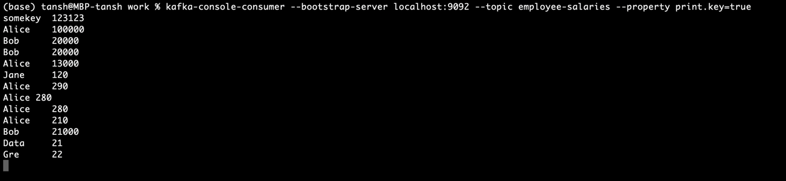
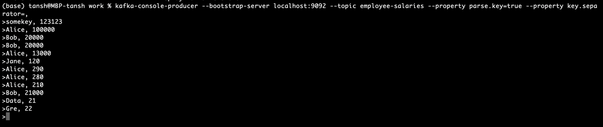
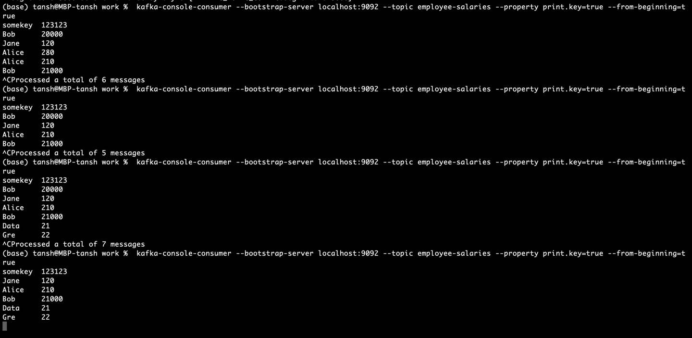

## Kafka
- visualizer https://softwaremill.com/kafka-visualisation/
- distributed streaming system
- horizontal scaling via brokers
- позволяет уменьшить количество интеграций
- успешна на real time переносах данных

## Настройки по умочанию - первым делом когда разворачиваете кластер
- `default.replication.factor=1`
- `auto.create.topics.enable=true` (когда пишут в несуществующий топик, применяются настройки по умолчанию)

### Размер на уровне топика и брокера
- `log.retention.bytes (на уровне брокера, unlimited)
- `retention.bytes` (на уровне топика, PER PARTITION)
- партиция это некоторая единица параллелизации

## Kafka Topics
- непрерывный поток данных
- как таблица в БД, но без constraint-ов, и тут нельзя делать запросы
- у каждого топика есть имя, по которому топик идентифицируется
- топик кафки `IMMUTABLE` - нельзя изменить или удалить данные с партиции, можно только дозаписывать
- чтобы записать данные в топик - нужно знать адрес любого брокера и название топика
- to read data from topic you need any broker and topic name

## Partitions and offsets
- каждый топик разделен на **партиции**, партиция которая содрержит message-ы в упорядоченном формате
- каждое сообщение содержит инкрементальный id в партиции, который называется **Kafka partition offset**-ом
- данные хранятся ограниченное время (default 1 week)
- offset-ы относятся ТОЛЬКО к ПАРТИЦИЯМ, у каждой партиции свой оффсет
- оффсеты НЕ переиспользуются, даже если данные были удалены
- порядок оффсета обеспечивается в каждой партиции отдельно, данные между партициями НЕ пересекаются
- **LEADER** and **ISR**

# Kafka partitions
- партиции хранятся на диске;
- партиции разделены на сегменты;
- партиции как единицы параллелизации хранения данных в топике;
- данные можно удалять только целыми сегментами;
- данные удаляются целыми сегментами либо по времени, либо по размеру;
- `retention.bytes=-1` (размер партиции ограничем размером диска)
- `retention.ms=604800000` - 1 неделя (данные хранятся в партиции)
- для каждого сегмента на диске хранится три файла `segment{basic_offset, data, index, timeindex}`
```
basic_offset is 0000123456789 (segment name)
data is         0000123456789.log (append only подход записи)
index is        0000123456789.index (чтобы быстро искать по offset)
timeindex is    0000123456789.timeindex (у каждого события есть время)
```
- сообщение можно быстро найти по его offset-у

## topic replication factor
- ONLY ONE BROKER can be leader of partition
- producers send data only for leader broker
- все реплики называются ISR - **IN SYNC REPLICA**
- у каждой партиции может быть только один ЛИДЕР, в которую записыввают и по умолчанию читают данные
- реплики ТОЛЬКО РАДИ репоикации данных (since v2.4+ can read from closest ISR - why? - network cost and latency)


## Quorum controller
- event driver architecture
- run in kafka cluster itself
- хранит свое событийное состояние так, что событийная модель  может быть воссоздана
- **events log stores this state**
- другие контроллеры читают события leader quorum controller-a, и сохраняют в своем журнале
- так пропущенные события могут легко восстановиться по журанлу событий
- **metadata топик** is events store


## Kafka Extended API
продюсеры и коесюмеры это просто низкоуровневое ПО
помимо них есть
### Kafka connect `[external source => kafka and kafka => external Sink]`
- `[source => connect cluster(worker) => kafka cluster(broker) => sink]`
- Source connector - to get Data from common data sources
- Sink connector - to publish in data sources
- ETL pipeline - extract, transform and load
- kafka connectors allow achieve fault tolerance, idempotence, distribution, ordering  
### Kafka Streams `kafka => kafka`
### Kafka Schema Registry `Schemas in kafka`


# Which API where use?
- Source database -> (**Kafka connect source**) -> Kafka -> (**Kafka Connect Sink**) -> Target Database, for storage or analyze later
- Different data producers, produce directly to kafka -> (**Kafka Producer**) -> Kafka -> (**Kafka Consumer**) -> consume data
- **Kafka streams** for kafka transformations
- **KSQL DB** - allows sql queries in kafka (leverages kafka streams)
- **Kafka registry** - behind the scenes, to make sure data is correct, and data types are accurate 

# SUMMARY
- для импорта данных из внешнего ресурса используйте **Kafka Connect Source**
- для трансформации данных от одного топика к другому используйте **Kafka Streams**
- для непрерывного экспорта к целевой БД используйте **Kafka Connect Sink** - лучший выбор для большинства популярных БД
- кафка сама по себе НЕ ВАЛИДИРУЕТ ВХОДНЫЕ ДАННЫЕ
- **Kafka Schema Registry** требует доп установки и настройки - по умолчанию она выключена


## Выбор кол-ва партиций на топик
- первая настройка на которую необходимо посмотреть
- увеличение кол-ва в течение жизни кластера сломает key ordering guarantees
- каждая партиция может справиться до нескольких MB per second

БОЛЬШЕ партиций значит
- выше пропускная способность, факт. параллелизм
- возможность запускать больше консюмеров в группе
- ability to leverage more brokers
- берегитесь зукипера на старых версиях (попадет под нагрузку)
Выбор кол-ва партиций - it's a million dollars question
- (intuition) Small cluster (less than 6 brokers) - 3 partitions per topic
- (intuition) Big cluster (more than 6 brokers) - 2 partitions per topic
- adjust for number of consumers and producers
- КАЖДЫЙ КЛАСТЕР имеет СВОЙ ПЕРФОРМАНС

## Выбор фактора репликаций

- как минимум 2, обычно 3, не нужно больше 4-ех

##### Чем выше реплик тем:
- лучшая надежность (durability) системы в факторе репликаций (`N-1`) - когда столько брокеров могут упасть прежде чем прекратить свою работу
- лучшая доступность (availability) когда (`N - min.insync.replicas` when `acks=all`) - (by default from kafka 3.0 acks = all)
- больше потребление дискового пространства
- больше задержка если забыли указать `min.insync.replicas`
Рекомендуется при запуске
- иметь три брокера и фактор репликации равный трем
- НИКОГДА на продакшене НЕ ИМЕЙТЕ ТОЛЬКО ОДНОГО БРОКЕРА

---

Максимальное кол-во партиций которых можно указать в кластере это 200 000 для кафки с Зукипером (ограничение), soft limit is 4000 partition per broker (НЕ БОЛЬШЕ 4000 партиций на 1 БРОКЕР)
- если нужно больше партиций, лучше добавьте больше брокеров
- для кафки с KRAFT - потенциально до миллионов партиций  


# Конвенция именования кафка топиков
- `snake_case`
- для безопасности рекомендуется разделить в иерархичном порядке (группировать)
- `<message_type>_<dataset_name>_<data_name>_<data_format>`

https://cnr.sh/essays/how-paint-bike-shed-kafka-topic-naming-conventions

### Типы сообщений `<message_type>`
- logging - для логируемых сообщений, как log4j, syslog
- streaming - промежуточные топики созданные в процессе потоковой обработки данных
- queuing - классическая очередь
- tracking - для отслеживания событий как клики, действия, просмотры
- etl/db - для перемещения данных по каналам CDC (change data capture, например, отследить изменения в БД и отправить всем остальным микросервисам или БД), или ETC(extract, transform and load)
- push - для данных которые будут вставлены из оффлайн окружения (возможно пачкой или батчем) калькуляций в онлайн
- user - scratches or test topics

### Dataset `<dataset_name>`
- same as database name 
- как категория для группировки топиков вместе

### DataName `<data_name>`
- same as table name
- можно иерархично создать табличное пространство tablespacename by dot (.)

### DataFormat `<data_format>`
- `.avro`, `.json`, `.csv`, `.text`, `.protobuf`, `.log`

--- 

## Примеры выбора топиков
### Трансляция видео
#### `show_position_topic`
- больше 30 партиций так как будет много продюсеров
- ключ партиционирвания userId чтобы данные об одном пользователе хранились в одной партиции
#### `recommendation_topic`
- для аналитических данных, не частое обновление
- соотв возможно с меньшим объемом
- как ключ userId

### Выбор такси
#### `user_position_topic` and `taxi_position_topic`
- много партиций (высоко нагружен)
- возможно ключ партиционирования по userId, taxiId
- данные не хранятся много времени
#### `surge_pricing_topic`
- данные приходят через кафка стримы
- ценообразование может сод доп логику как учет регионов, погоды etc (high volume)

## Хранение данных в сегменте
- топики состоят из партиций
- партиции состоят из сегментов размером 1 ГБ по умолчанию
- настройка `log.segment.bytes` - максимальный размер сегмента после чего будет создан новый
- настройка `log.segment.ms` - время, после которого кафка закоммитит сегмент, даже если не достиг `log.segment.bytes`, по умолчанию after 1 week new segment will be opened
- данные всегда пишутся в последний (горячий) сегмент в последовательном порядке,
- например `[segment-0; offset (0-958)] [segment-1; offset (959-1450)] [segment-2; offset (1451-?)] - ACTIVE SEGMENT` 

# Сегменты
- каждый сегмент состоит из двух индексов (files)
- `TIMESTAMP INDEX` - помогает найти сообщение с заданного времени
- `POSITION INDEX` (помогает быстро найти сообщение по определенному offset-у)

### Что учитывать?
Нужно ли уменьшать значение маленьких `log.segment.bytes`?
- чаще log compaction
- больше сегментов НА партицию
- кафка сохраняет большее число файлов открытыми (Error: too many files opened)
- основывайтесь на своем throughput

Нужно ли уменьшать значение `log.segment.ms`
- ежедневные сегменты вместо еженедельных
- больше триггеров на компактинг сегментов

# Log cleanup policy
- политика истекших данных

### `log.cleanup.policy=delete` (default for all user topics)
- Based on **age of data** (default is 1 week), по умолчанию после недели данные с последних сегментов удаляются 
- Based on **max size of data** (default is -1 = infinite ) - можно настроить стирание данных по времени

##### `log.retention.hours` - сколько времени хранить данные до удаления (default 1 week = 168 hours) 
- higher number means more disk space
- lower number means less data will be retained (stored, saved)
- other params `log.retention.ms`, `log.retention.minutes` - меньшее значение имеет приоритет, так что обратите внимание на все три настройки

##### `log.retention.bytes` - максимальное кол-во байтов на каждую партицию
- чтобы использовать размер в качестве определенного порога
- по умолчанию infinite == -1

две популярные настройки:
1) по времени и бесконечному размеру
`log.retention.hours=168` and `log.retention.bytes=-1`
2) по конечному размеру и бесконечному времени
`log.retention.ms=-1` and `log.retention.bytes=524288000`

### `log.cleanup.policy=compact` (default for topic__consumer_offsets_)
- помогает достичь уникальности по ключам исторических событий, и хранится последнее записанное событие
- сегменты компактируются в новый
- перезаписывается значение по ключу от последнего оффсета
- log compaction НЕ изменяет оффсеты
- log compaction просто удаляет старые дублирующиеся ключи
- log compaction keeps ordering by ossfet
- offsets are immutable, they're just skipping is msg does not exist
- удаленные сообщения все еще можно прочитать конюмером в течение времени `delete.retention.ms` (default 24 hours)
- дедубликация данных происходит после коммита сегмента
- конюсмеры будут продолжать читать свежие данные, даже если прилетели дубликаты а старые не были удалены - так что кафка не гарантирует уникальность
- log compaction thread может ломаться время от времени - требуется перезагрузить брокер кафки
- log compaction нельзя вызвать по вызову API - возможно появится в будущем
- log compaction НЕ РАБОТАЕТ НА АКТИВНОМ СЕГМЕНТЕ ПАРТИЦИИ

** зависит от следующих конфигов **

- `segment.bytes` (1 GB) - max amount of size to close active segment
- `segment.ms` (7 days) - max amount of time to close active segment
- `min.compaction.lag.ms` (0) - how long wait before msg will be compacted
- `delete.retention.ms` (24 hours) - wait before marked data will be removed
- `min.cleanable.dirty.ratio` (default 0.5)

1) create topic
```bash
(base) tansh@MBP-tansh work % kafka-topics --bootstrap-server localhost:9092 --topic employee-salaries --create --config cleanup.policy=compact --config segment.ms=5000 --partitions 1 --replication-factor 1 --config min.cleanable.dirty.ratio=0.01
Created topic employee-salaries.
(base) tansh@MBP-tansh work % kafka-topics --bootstrap-server localhost:9092 --topic employee-salaries --describe                                            
Topic: employee-salaries	TopicId: mJayq58uTKyjrU5oeNrkTw	PartitionCount: 1	ReplicationFactor: 1	Configs: cleanup.policy=compact,min.cleanable.dirty.ratio=0.01,segment.ms=5000
Topic: employee-salaries	Partition: 0	Leader: 1	Replicas: 1	Isr: 1
(base) tansh@MBP-tansh work % kafka-configs --bootstrap-server localhost:9092 --entity-type topics --entity-name employee-salaries --alter --add-config min.cleanable.dirty.ratio=0.001
Completed updating config for topic employee-salaries.
(base) tansh@MBP-tansh work % kafka-configs --bootstrap-server localhost:9092 --entity-type topics --entity-name employee-salaries --describe
Dynamic configs for topic employee-salaries are:
  cleanup.policy=compact sensitive=false synonyms={DYNAMIC_TOPIC_CONFIG:cleanup.policy=compact, DEFAULT_CONFIG:log.cleanup.policy=delete}
  min.cleanable.dirty.ratio=0.001 sensitive=false synonyms={DYNAMIC_TOPIC_CONFIG:min.cleanable.dirty.ratio=0.001, DEFAULT_CONFIG:log.cleaner.min.cleanable.ratio=0.5}
  segment.ms=5000 sensitive=false synonyms={DYNAMIC_TOPIC_CONFIG:segment.ms=5000}
```

2) create consumer
```bash
kafka-console-consumer --bootstrap-server localhost:9092 --topic employee-salaries --property print.key=true
```



3) create producer

```bash
kafka-console-producer --bootstrap-server localhost:9092 --topic employee-salaries --property parse.key=true --property key.separator=,
```



4) create and test second consumer,
duplicated keys will be destroyed within logs are compacted




```bash
(base) tansh@MBP-tansh work % kafka-topics --bootstrap-server localhost:9092 --describe --topic __consumer_offsets
Topic: __consumer_offsets	TopicId: M0eUVPliR6uWFPsMZZ4p3g	PartitionCount: 50	ReplicationFactor: 1	Configs: compression.type=producer,cleanup.policy=compact,segment.bytes=104857600
Topic: __consumer_offsets	Partition: 0	Leader: 1	Replicas: 1	Isr: 1
Topic: __consumer_offsets	Partition: 1	Leader: 1	Replicas: 1	Isr: 1
***
```

Настройка Configs: compression.type=producer,cleanup.policy=compact - deletes based on your message key
- удалит все дубликаты по ключу после коммита активного сегмента
- infinite time and space retention

Зачем нужен log.cleanup.policy
- для контроля размера на диске
- для удаления ненужных данных

Как часто это происходит?
- Log cleanup работает по СЕГМЕНТАМ
- small and more segments means log cleanup will happen often
- Log cleanup takes CPU and RAM resources
- The cleaner chekcks every 15 seconds (`log.cleaner.backoff.ms`)

## `unclean.leader.election.enable`
- 1 случай, когда у вас ISR реплики упали, но есть sync replicas, по умолчанию ожидается поднятие одной из ISR реплик
- 2 случай, можно включить `unclean.leader.election.enable=true` чтобы начать to start producing to non ISR partitions (в этом случае NON ISR partition will be the leader)
- во 2-cлучае повышается availability, но есть риск потерять некоторые данные во всех остальных репликах, даже если они там был (даже с предыдущего лидера который содержал актуальные данные), так как лидер всегда основной
- эту настройку можно включать если доступность записи данных важнее нежели их сохранность в партиции'

# Sending large messages - id anti-pattern on kafka
- default msg size is 1 MB
- при изменении размера в одном месте, понадобится подпраивть настройки у брокера, продюсера и консюмера
- если очень необходимо, можно сохранять file reference to kafka, но сам медиа файл должен храниться в отдельном медиа сервере 
- если никак, необходиом настроить след настройки

### 1) topic-wise, kafka-side - set max smg size to 10 MB
```bash
broderk-side: message.max.bytes
topic-side: max.message.bytes
- имена идентичны, но это две разные настройки!!
```
### 2) broker side
```properties
replica.fetch.max.bytes=10485880 (in server.properties)
```
### 3) consumer side
```properties
max.partition.fetch.max.bytes=10485880
```
### 4) producer side
```properties
max.request.size=10485880
```

