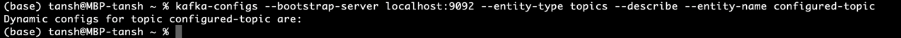

# Why I prefer to use kafka?
- в rabbit mq данные хранятся в памяти (можно сделать персистентные очереди) - но кафка выиграет
- произодительностью и стримингом БОЛЬШИХ данных
- почитай про lambda architecture and K-architecture 
- данные хранятся на диске
- высокая производительность
- много консюмеров и много продюсеров
- работает буквально на уровне скорости сети

# чего нет в кафке из коробки?
- отложенных сообщений, все максимально просто
- очереди с приоритетом (всегда пишем в конец)
- TTL на сообщение (есть только в рамах сегмента)
  
# CLI commands
### Создать топик
```bash
kafka-topics --bootstrap-server localhost:9092 --create --topic hello
kafka-topics --bootstrap-server localhost:9092 --create --topic hello2 --partitions=3
```
### Cписок топиков
```
 kafka-topics --bootstrap-server localhost:9092 --list
```
### Описание топиков
```
kafka-topics --bootstrap-server localhost:9092  --describe
```
#### WARNING! Replication factor cannot be more than the number of brokers
```
kafka-topics --bootstrap-server localhost:9092 --create --topic hello3 --replication-factor=2
# InvalidReplicationFactorException: The target replication factor of 2 cannot be reached because only 1 broker(s) are registered.
kafka-topics --bootstrap-server localhost:9092 --create --topic hello3 --replication-factor=1 
# Created topic hello3.
```

### Удалить топик
```bash
kafka-topics --bootstrap-server localhost:9092 --delete --topic hello
```
# Kafka Console Producer CLI
- with key (distributes across all partitions)
- without key (same key always go to the same partition)

### Console producer 
```
 kafka-console-producer --bootstrap-server localhost:9092 --topic hello2
```


### Передача параметров продюсеру (producer property keys, f.e. acks=all)
```
kafka-console-producer --bootstrap-server localhost:9092 --topic hello2 --producer-property acks=all
```

#### WARNING! Not declared topic will be created
- не объявленный топик кинет предупреждение и создастся (worked on loccalhost with one partition)

```
kafka-console-producer --bootstrap-server localhost:9092 --topic new_non_found_topic 
```


- если эту команду запустить для распределенного кластера кинет ошибку

```
TimeOutException - ERROR when sending message to topic new_topic with key: null. ... Topic not present in metadata after 60000 ms
```

### Produce with keys
```
kafka-console-producer --bootstrap-server localhost:9092 --topic hello2 --property parse.key=true --property key.separator=:

>hello:value
>hhh
org.apache.kafka.common.KafkaException: No key separator found on line number 2: 'hhh'
	at kafka.tools.ConsoleProducer$LineMessageReader.parse(ConsoleProducer.scala:381)
	at kafka.tools.ConsoleProducer$LineMessageReader.readMessage(ConsoleProducer.scala:356)
	at kafka.tools.ConsoleProducer$.main(ConsoleProducer.scala:50)
	at kafka.tools.ConsoleProducer.main(ConsoleProducer.scala)
```

# Kafka Console Consumer CLI

- by default 16 KB of data goes to the same partition
- чтение --from-beginning начинается с самого начала когда продюсер производит хоть одно сообщение
- to consume from the beginning use `--from-beginning` (по умолчанию после поделючения начинает консюмить только новые сообщения)
```
kafka-console-consumer --bootstrap-server localhost:9092 --topic hello2 --from-beginning 
```


### DefaultMessageFormatter for consumer CLI
- напечатать сообщения с форматтером на консоли
```
kafka-console-consumer --bootstrap-server localhost:9092 --topic hello2 --formatter \ kafka.tools.DefaultMessageFormatter --from-beginning --property print.timestamp=true --property \ print.partition=true --property print.value=true --property print.key=true
```


- produce without round robin (по умолчанию пока не заполнится 16 КБ)


- produce with **Round robin producer** - отправлять в партиции методом раунд робина (ТОЛЬКО для текущего продюсера)
  
```
kafka-console-producer --bootstrap-server localhost:9092 --producer-property partitioner.class=org.apache.kafka.clients.producer.RoundRobinPartitioner --topic hello2
```


### Consumer groups
- лишние консюмеры в консюмер группе будут неактивными
- не имеет смысл регистрировать больше консюмеров чем кол-во партиций в топике
- если для консбмера не указать группу - он создаст temporary consumer-group
1) create topic
```
(base) tansh@MBP-tansh ~ % kafka-topics --bootstrap-server localhost:9092 --create --topic mytopic         Created topic mytopic.
```
2) append producer


3) Добавьте группу консюмеров (может быть больше числа партиций в топике)
- опция --from-beginning имеет место только для первого консюмера, остальные повторы не начинают чтение сообщений с начала в рамках группы
```
kafka-console-consumer --bootstrap-server localhost:9092 --topic mytopic --group group1 --from-beginning
kafka-console-consumer --bootstrap-server localhost:9092 --topic mytopic --group group1 --from-beginning
kafka-console-consumer --bootstrap-server localhost:9092 --topic mytopic --group group1 --from-beginning
kafka-console-consumer --bootstrap-server localhost:9092 --topic mytopic --group group1 --from-beginning
```

4) Консюмер другой группы - начнет чтение с начала
```
kafka-console-consumer --bootstrap-server localhost:9092 --topic mytopic --group group2 --from-beginning
```


5) каждое сообщение из продюсера направится во все группы
- each consumer-group has the same data
- each consumer-group has its own independent offset


- нельзя уменьшать кол-во партиций, если из нее читает группа консюмеров
```
[2023-08-30 20:42:13,399] WARN [Consumer clientId=console-consumer, groupId=group1] Offset commit failed on partition mytopic-2 at offset 6: This server does not host this topic-partition. (org.apache.kafka.clients.consumer.internals.ConsumerCoordinator)
```

# Kafka consumer group CLI


### List of consumer groups

- consumer without group will accept all data from topic
- consumer without group has temporary group (`f.e. console-consumer-25698`)

```
kafka-consumer-groups --bootstrap-server localhost:9092 --list
```


### Descibe one consumer group

- по `consumer ID` можно узнать, какой консюмер читает из какой партиции
```
kafka-consumer-groups --bootstrap-server localhost:9092 --group group1 --describe
```


## LAG - when messages produced but not consumed or committed

- `Consumer group 'group1' has no active members.`
  


- если подключить консюмер данной группы - ЛАГ исчезнет


# Reset consumer-group-offsets

- `--dry-run` показывает, какие партиции в топике будут сброшены
- `-execute` исполняет сброс
  
```bash
kafka-consumer-groups --bootstrap-server localhost:9092 --group group1 --reset-offsets --to-earliest --topic mytopic --dry-run
```
```bash
kafka-consumer-groups --bootstrap-server localhost:9092 --group group1 --reset-offsets --to-earliest --topic mytopic --execute
```


- вы не можете сбросить пока не остановите всех консюмеров из группы
```
Error: Assignments can only be reset if the group 'group1' is inactive, but the current state is Stable.
```

- `--to-latest` - default option - подключенный консюмер читает с последнего коммита (c накопленных лагов)
- `--to-earliest` - чтение с самого начала


# Topic configuration commands

Важные настройки о которых не стоит забывать
- replication factor
- partition size
- message size
- compression level
- log cleanup policy
- min.insync.replicas

```bash
(base) tansh@MBP-tansh ~ % kafka-topics --bootstrap-server localhost:9092 --create --topic configured-topic --replication-factor 1 --partitions 3 
Created topic configured-topic.
(base) tansh@MBP-tansh ~ % kafka-topics --bootstrap-server localhost:9092 --topic configured-topic --describe                            
Topic: configured-topic	TopicId: qBV3wmR7QUiBcXNNZKLu2A	PartitionCount: 3	ReplicationFactor: 1	Configs: 
	Topic: configured-topic	Partition: 0	Leader: 1	Replicas: 1	Isr: 1
	Topic: configured-topic	Partition: 1	Leader: 1	Replicas: 1	Isr: 1
	Topic: configured-topic	Partition: 2	Leader: 1	Replicas: 1	Isr: 1
(base) tansh@MBP-tansh ~ % 
```

kafka configs shell

```bash
(base) tansh@MBP-tansh ~ % kafka-configs
This tool helps to manipulate and describe entity config for a topic, client, user, broker or ip
Option                                 Description                            
------                                 -----------                            
--add-config <String>                  Key Value pairs of configs to add.     
                                         Square brackets can be used to group 
                                         values which contain commas: 'k1=v1, 
                                         k2=[v1,v2,v2],k3=v3'. The following  
                                         is a list of valid configurations:   
                                         For entity-type 'topics':            
                                       	cleanup.policy                        
                                       	compression.type                      
                                       	delete.retention.ms                   
                                       	file.delete.delay.ms                  
                                       	flush.messages                        
                                       	flush.ms                              
                                       	follower.replication.throttled.       
                                         replicas                             
                                       	index.interval.bytes                  
                                       	leader.replication.throttled.replicas 
                                       	local.retention.bytes                 
                                       	local.retention.ms                    
                                       	max.compaction.lag.ms                 
                                       	max.message.bytes                     
                                       	message.downconversion.enable         
                                       	message.format.version                
                                       	message.timestamp.after.max.ms        
                                       	message.timestamp.before.max.ms       
                                       	message.timestamp.difference.max.ms   
                                       	message.timestamp.type                
                                       	min.cleanable.dirty.ratio             
                                       	min.compaction.lag.ms                 
                                       	min.insync.replicas                   
                                       	preallocate                           
                                       	remote.storage.enable                 
                                       	retention.bytes                       
                                       	retention.ms                          
                                       	segment.bytes                         
                                       	segment.index.bytes                   
                                       	segment.jitter.ms                     
                                       	segment.ms                            
                                       	unclean.leader.election.enable        
                                       For entity-type 'brokers':             
                                       	advertised.listeners                  
                                       	background.threads                    
                                       	compression.type                      
                                       	follower.replication.throttled.rate   
                                       	leader.replication.throttled.rate     
                                       	listener.security.protocol.map        
                                       	listeners                             
                                       	log.cleaner.backoff.ms                
                                       	log.cleaner.dedupe.buffer.size        
                                       	log.cleaner.delete.retention.ms       
                                       	log.cleaner.io.buffer.load.factor     
                                       	log.cleaner.io.buffer.size            
                                       	log.cleaner.io.max.bytes.per.second   
                                       	log.cleaner.max.compaction.lag.ms     
                                       	log.cleaner.min.cleanable.ratio       
                                       	log.cleaner.min.compaction.lag.ms     
                                       	log.cleaner.threads                   
                                       	log.cleanup.policy                    
                                       	log.flush.interval.messages           
                                       	log.flush.interval.ms                 
                                       	log.index.interval.bytes              
                                       	log.index.size.max.bytes              
                                       	log.local.retention.bytes             
                                       	log.local.retention.ms                
                                       	log.message.downconversion.enable     
                                       	log.message.timestamp.after.max.ms    
                                       	log.message.timestamp.before.max.ms   
                                       	log.message.timestamp.difference.max. 
                                         ms                                   
                                       	log.message.timestamp.type            
                                       	log.preallocate                       
                                       	log.retention.bytes                   
                                       	log.retention.ms                      
                                       	log.roll.jitter.ms                    
                                       	log.roll.ms                           
                                       	log.segment.bytes                     
                                       	log.segment.delete.delay.ms           
                                       	max.connection.creation.rate          
                                       	max.connections                       
                                       	max.connections.per.ip                
                                       	max.connections.per.ip.overrides      
                                       	message.max.bytes                     
                                       	metric.reporters                      
                                       	min.insync.replicas                   
                                       	num.io.threads                        
                                       	num.network.threads                   
                                       	num.recovery.threads.per.data.dir     
                                       	num.replica.fetchers                  
                                       	principal.builder.class               
                                       	producer.id.expiration.ms             
                                       	replica.alter.log.dirs.io.max.bytes.  
                                         per.second                           
                                       	sasl.enabled.mechanisms               
                                       	sasl.jaas.config                      
                                       	sasl.kerberos.kinit.cmd               
                                       	sasl.kerberos.min.time.before.relogin 
                                       	sasl.kerberos.principal.to.local.rules
                                       	sasl.kerberos.service.name            
                                       	sasl.kerberos.ticket.renew.jitter     
                                       	sasl.kerberos.ticket.renew.window.    
                                         factor                               
                                       	sasl.login.refresh.buffer.seconds     
                                       	sasl.login.refresh.min.period.seconds 
                                       	sasl.login.refresh.window.factor      
                                       	sasl.login.refresh.window.jitter      
                                       	sasl.mechanism.inter.broker.protocol  
                                       	ssl.cipher.suites                     
                                       	ssl.client.auth                       
                                       	ssl.enabled.protocols                 
                                       	ssl.endpoint.identification.algorithm 
                                       	ssl.engine.factory.class              
                                       	ssl.key.password                      
                                       	ssl.keymanager.algorithm              
                                       	ssl.keystore.certificate.chain        
                                       	ssl.keystore.key                      
                                       	ssl.keystore.location                 
                                       	ssl.keystore.password                 
                                       	ssl.keystore.type                     
                                       	ssl.protocol                          
                                       	ssl.provider                          
                                       	ssl.secure.random.implementation      
                                       	ssl.trustmanager.algorithm            
                                       	ssl.truststore.certificates           
                                       	ssl.truststore.location               
                                       	ssl.truststore.password               
                                       	ssl.truststore.type                   
                                       	transaction.partition.verification.   
                                         enable                               
                                       	unclean.leader.election.enable        
                                       For entity-type 'users':               
                                       	SCRAM-SHA-256                         
                                       	SCRAM-SHA-512                         
                                       	consumer_byte_rate                    
                                       	controller_mutation_rate              
                                       	producer_byte_rate                    
                                       	request_percentage                    
                                       For entity-type 'clients':             
                                       	consumer_byte_rate                    
                                       	controller_mutation_rate              
                                       	producer_byte_rate                    
                                       	request_percentage                    
                                       For entity-type 'ips':                 
                                       	connection_creation_rate              
                                       Entity types 'users' and 'clients' may 
                                         be specified together to update      
                                         config for clients of a specific     
                                         user.                                
--add-config-file <String>             Path to a properties file with configs 
                                         to add. See add-config for a list of 
                                         valid configurations.                
--all                                  List all configs for the given topic,  
                                         broker, or broker-logger entity      
                                         (includes static configuration when  
                                         the entity type is brokers)          
--alter                                Alter the configuration for the entity.
--bootstrap-server <String: server to  The Kafka server to connect to. This   
  connect to>                            is required for describing and       
                                         altering broker configs.             
--broker <String>                      The broker's ID.                       
--broker-defaults                      The config defaults for all brokers.   
--broker-logger <String>               The broker's ID for its logger config. 
--client <String>                      The client's ID.                       
--client-defaults                      The config defaults for all clients.   
--command-config <String: command      Property file containing configs to be 
  config property file>                  passed to Admin Client. This is used 
                                         only with --bootstrap-server option  
                                         for describing and altering broker   
                                         configs.                             
--delete-config <String>               config keys to remove 'k1,k2'          
--describe                             List configs for the given entity.     
--entity-default                       Default entity name for                
                                         clients/users/brokers/ips (applies   
                                         to corresponding entity type in      
                                         command line)                        
--entity-name <String>                 Name of entity (topic name/client      
                                         id/user principal name/broker id/ip) 
--entity-type <String>                 Type of entity                         
                                         (topics/clients/users/brokers/broker-
                                         loggers/ips)                         
--force                                Suppress console prompts               
--help                                 Print usage information.               
--ip <String>                          The IP address.                        
--ip-defaults                          The config defaults for all IPs.       
--topic <String>                       The topic's name.                      
--user <String>                        The user's principal name.             
--user-defaults                        The config defaults for all users.     
--version                              Display Kafka version.                 
--zk-tls-config-file <String:          Identifies the file where ZooKeeper    
  ZooKeeper TLS configuration>           client TLS connectivity properties   
                                         are defined.  Any properties other   
                                         than zookeeper.clientCnxnSocket,     
                                         zookeeper.ssl.cipher.suites,         
                                         zookeeper.ssl.client.enable,         
                                         zookeeper.ssl.crl.enable, zookeeper. 
                                         ssl.enabled.protocols, zookeeper.ssl.
                                         endpoint.identification.algorithm,   
                                         zookeeper.ssl.keystore.location,     
                                         zookeeper.ssl.keystore.password,     
                                         zookeeper.ssl.keystore.type,         
                                         zookeeper.ssl.ocsp.enable, zookeeper.
                                         ssl.protocol, zookeeper.ssl.         
                                         truststore.location, zookeeper.ssl.  
                                         truststore.password, zookeeper.ssl.  
                                         truststore.type are ignored.         
--zookeeper <String: urls>             DEPRECATED. The connection string for  
                                         the zookeeper connection in the form 
                                         host:port. Multiple URLS can be      
                                         given to allow fail-over. Required   
                                         when configuring SCRAM credentials   
                                         for users or dynamic broker configs  
                                         when the relevant broker(s) are      
                                         down. Not allowed otherwise.         
(base) tansh@MBP-tansh ~ %
```

### Список настроенных динамических конфигов
```bash
(base) tansh@MBP-tansh ~ % kafka-configs --bootstrap-server localhost:9092 --entity-type topics --entity-name configured-topic --describe 
Dynamic configs for topic configured-topic are:
```



### Внести изменения в конфигурацию топика

```bash
(base) tansh@MBP-tansh ~ % kafka-configs --bootstrap-server localhost:9092 --entity-type topics --entity-name configured-topic --alter
At least one of --add-config, --add-config-file, or --delete-config must be specified with --alter
```


```bash
(base) tansh@MBP-tansh ~ % kafka-configs --bootstrap-server localhost:9092 --entity-type topics --entity-name configured-topic --alter --add-config min.insync.replicas=2
Completed updating config for topic configured-topic.

(base) tansh@MBP-tansh ~ % kafka-configs --bootstrap-server localhost:9092 --entity-type topics --entity-name configured-topic --describe
Dynamic configs for topic configured-topic are:
  min.insync.replicas=2 sensitive=false synonyms={DYNAMIC_TOPIC_CONFIG:min.insync.replicas=2, DEFAULT_CONFIG:min.insync.replicas=1}
(base) tansh@MBP-tansh ~ % 

(base) tansh@MBP-tansh ~ % kafka-topics --bootstrap-server localhost:9092 --topic configured-topic --describe                            
Topic: configured-topic	TopicId: qBV3wmR7QUiBcXNNZKLu2A	PartitionCount: 3	ReplicationFactor: 1	Configs: min.insync.replicas=2
	Topic: configured-topic	Partition: 0	Leader: 1	Replicas: 1	Isr: 1
	Topic: configured-topic	Partition: 1	Leader: 1	Replicas: 1	Isr: 1
	Topic: configured-topic	Partition: 2	Leader: 1	Replicas: 1	Isr: 1
(base) tansh@MBP-tansh ~ % 
```
