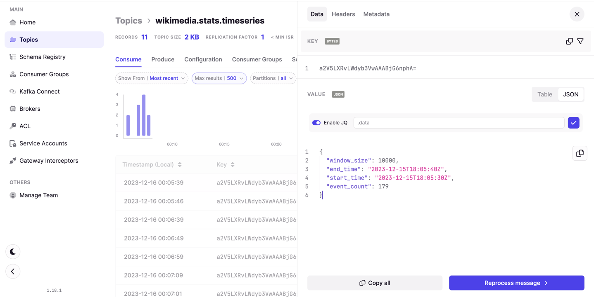
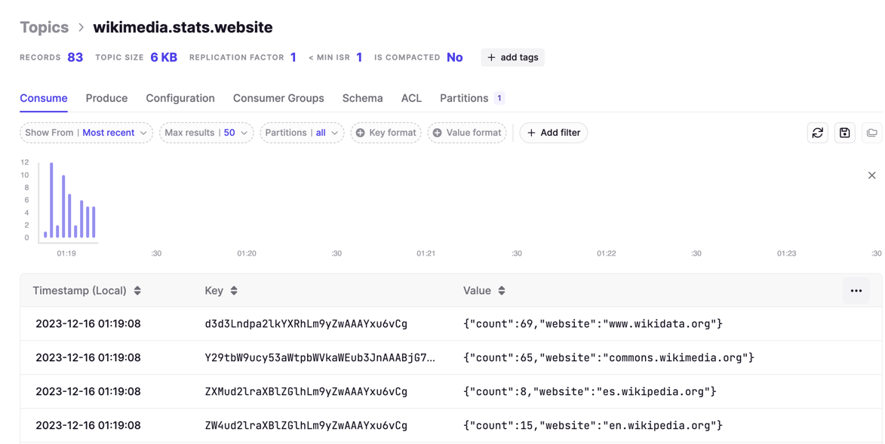

# Tables and streams
- удобная прослойка над кафкой и абстракция
- переход мышления на потоковый способ обработки надо привыкнуть

Ktable - `key/value stream + changlelog`
GlobalKTable - join between workers

1) `table table join` декартово произведение и выборка, например по ключу
2) `stream/table join lookup` (по стриму поиск в таблице) - поток событий, на момент события какая инфа была в таблице
3) `stream-stream window join` - ограничены окном в виде буфера по времени

`RocksDB (key + timestamp + seqnum)` sort lexicography (строка в бинарное представление времени которое оно представляет, что есть в localStore подходящее по времени внутри рокс дб - O(log(N)))

`withTimestampExtractor` - время штука тонкая в распределенных системах. Бери время из модели события

1) tumbling windom /_/
2) hopling window []
3) session window

Window retention time - удаление старых событий с рокс бд
Grace time - должен быть меньше чем retention time. События опоздавшие на час учитываться задним событием не будут
Punctuator - нарезка потока, не оконные операторы. 

насколько долго мы можем обрабатывать данные?

Join двух таблиц, и топики дублируются

- table is the интеграл от потока
- поток это производная от таблицы
  
`uv = u'v + v'u`

# What is Kafka Streams?
- для обработки потока данных внутри кафка кластера
- выявление аномалий (по безопасности)
- потоковая обработка и преобразование
- мониторинг и уведомления
- это стандартное Java приложение
- нет необходимости создавать отдельный кластер
- отказоустойчива
- гибка в настройке и масштабировании
- идемпотентность при передаче данных (exactly once)
- нет батчинга. Одна запись на единицу времени
- stream process means in addition some logic between data translation
- functional Java API
- filtering, grouping events, aggregating, joining streams
- scalable, fault-tolerance state management
- consumers tend to grow in their complexity
- key aggregation, additional logic, delivery semantic settings,

## Как настроить?
- включите контейнеры проекта `kafka/conduktor-platform/docker-compose.yml`
- запустите продюсер на топик `wikimedia.recentchange`
- запустите стримы

Топики появятся в консоли платформы
- базовый топик, от которого читает кафка стрим это `wikimedia.recentchange` (сюда продюсер собирает все данные)

Основные настроенные процессоры находятся в папке `processors` пишут в свои топики
- `wikimedia.stats.bots`

- `wikimedia.stats.timeseries`

- `wikimedia.stats.website`

- все остальное называется внутренними топиками - созданными приложением kafka-streams для функционирования
и сохраняют свои метаданные в материализованных внутренних хранилищах:
- `bot-count-store`
- `event.count.store`
- `website-count-store`

