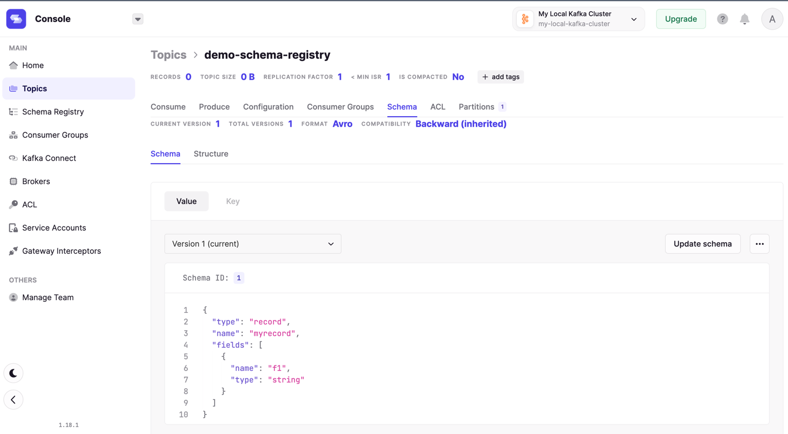
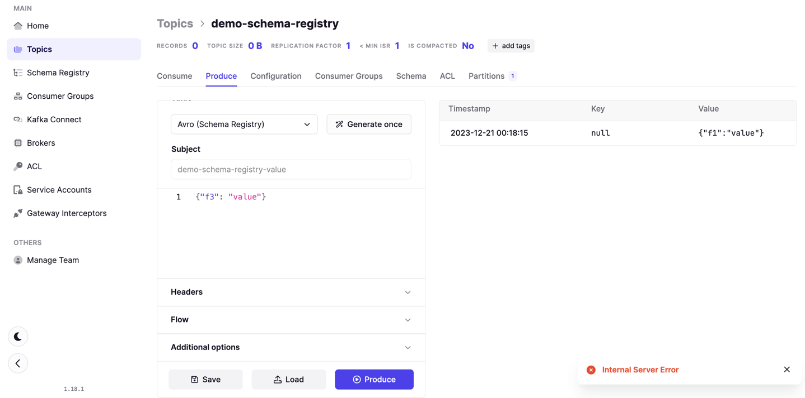
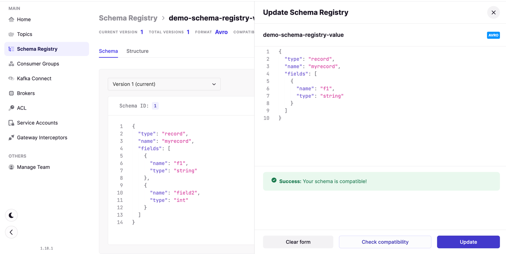
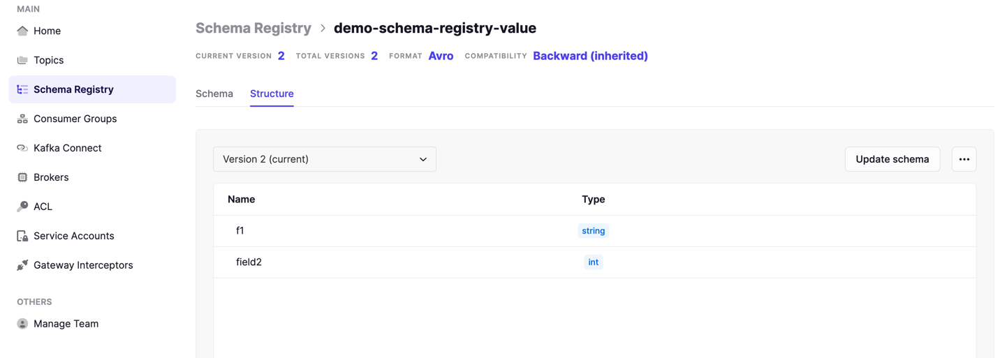
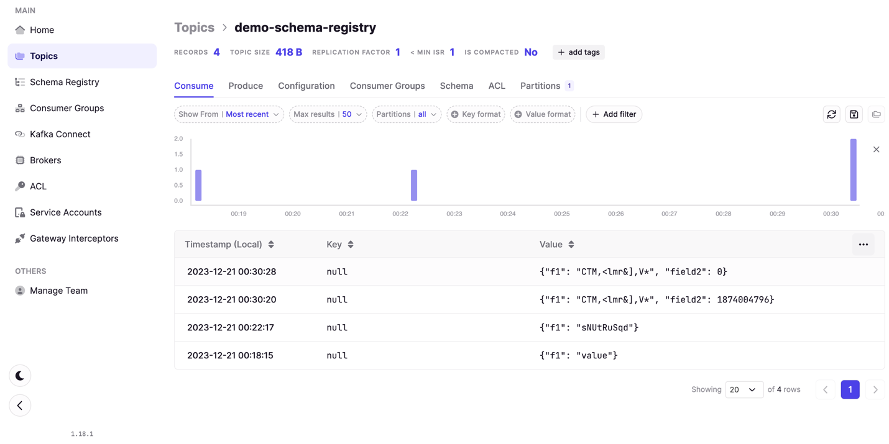

- кафка переводит только потоки байтов (серия нулей и единиц как от продюсера, так и к консюмеру) и здесь нет валидации
- input stream without loading them into memory без это называется zero copy 
- kafka does not parse or read your data (no CPU usage)

### Purpose
- определение схемы входных (формата) данных для топика (название полей и типы полей)
- хранить и извлекать схемы из регистра
- уменьшить размер данных посылаемых кафке
- полная обратная совместимость с топиками
- apache avro format
- понадобится частично изменить код продюсера и консюмера
- что если изменились поля или формат сообщений (кафка не сможет десериализировать)
- схема делает данные самоописуемыми
- схема rejects bad data
- consumers and producers must be able to talk with schema registry
- регистр должен быть highly available


## Create schema registry for topic


1) Create kafka topic

```bash
kafka-topics --bootstrap-server localhost:9092  --create --topic demo-schema-registry
```


2) Create Schema registry (with Avro data format)


- defines how data should like in topic
```json
{
  "type": "record",
  "name": "myrecord",
  "fields" : [
    {"name": "f1", "type": "string"}
  ]
}
```


3) Во вкладке топика появилась схема регистра




4) Валидные данные вставляются в топик


5) Невалидные данные просто не даст вставить



6) Схему регистров можно также обновить (должны быть совместимы)

```json
{
	"type": "record",
	"name": "myrecord",
	"fields": [
		{
			"name": "f1",
			"type": "string"
		},
		{
			"name": "field2",
			"type": "int",
			"default": 0
		}
	]
}
```




7) Структура схемы регистра изменилась, теперь тут два поля
- одно из которых имеет значение по умолчанию



**Schema registry makes kafka follow specific format**


