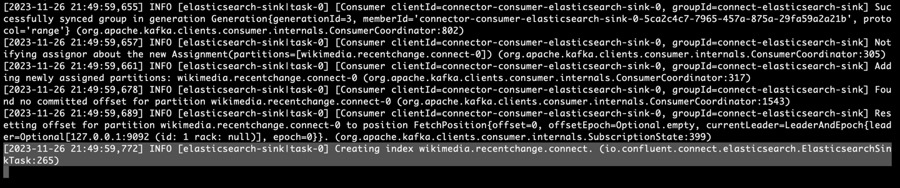
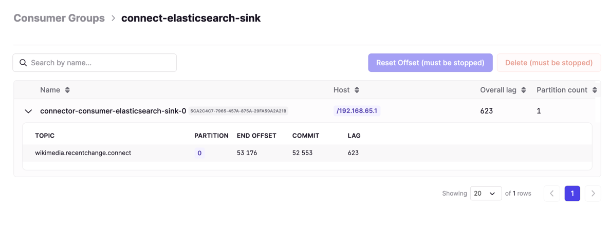
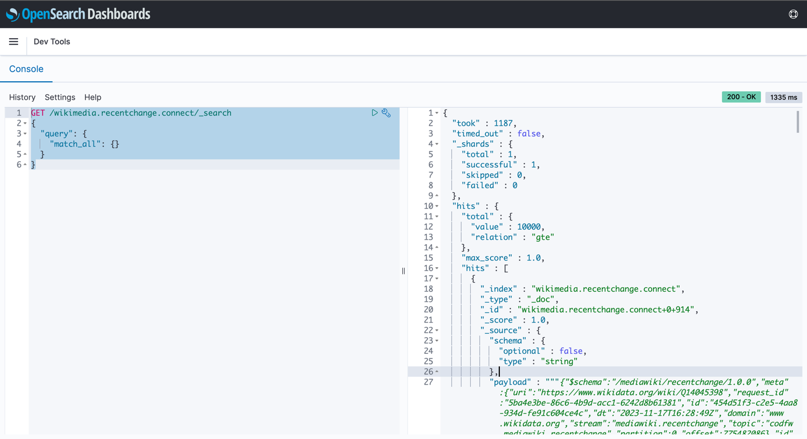

# Elasticsearch Service Sink Connector
- установите зип https://docs.confluent.io/kafka-connectors/elasticsearch/current/overview.html
- установите .jar https://github.com/conduktor/kafka-connect-wikimedia/releases

### Run

### Запустить чтение из стороннего стрима (сбор в топик)
```bash
pwd
# /opt/homebrew/Cellar/kafka/3.4.0/connectors
connectors % connect-standalone config/connect-standalone.properties config/wikimedia.properties
# this will run Kafka Connect Producer
```

```log
[2023-11-17 22:32:39,344] INFO Kafka Connect standalone worker initializing ... (org.apache.kafka.connect.cli.ConnectStandalone:68)
[2023-11-17 22:32:39,348] INFO WorkerInfo values: 
	jvm.args = -Xms256M, -Xmx2G, -XX:+UseG1GC, -XX:MaxGCPauseMillis=20, -XX:InitiatingHeapOccupancyPercent=35, -XX:+ExplicitGCInvokesConcurrent, -XX:MaxInlineLevel=15, -Djava.awt.headless=true, -Dcom.sun.management.jmxremote, -Dcom.sun.management.jmxremote.authenticate=false, -Dcom.sun.management.jmxremote.ssl=false, -Dkafka.logs.dir=/opt/homebrew/Cellar/kafka/3.4.0/libexec/bin/../logs, -Dlog4j.configuration=file:/opt/homebrew/Cellar/kafka/3.4.0/libexec/bin/../config/connect-log4j.properties
	jvm.spec = Homebrew, OpenJDK 64-Bit Server VM, 20.0.1, 20.0.1
	jvm.classpath = /opt/homebrew/Cellar/kafka/3.4.0/libexec/bin/../libs/activation-1.1.1.jar:/opt/homebrew/Cellar/kafka/3.4.0/libexec/bin/../libs/aopalliance-repackaged-2.6.1.jar:/opt/homebrew/Cellar/kafka/3.4.0/libexec/bin/../libs/argparse4j-0.7.0.jar:/opt/homebrew/Cellar/kafka/3.4.0/libexec/bin/../libs/audience-annotations-0.5.0.jar:/opt/homebrew/Cellar/kafka/3.4.0/libexec/bin/../libs/commons-cli-1.4.jar:/opt/homebrew/Cellar/kafka/3.4.0/libexec/bin/../libs/commons-lang3-3.8.1.jar:/opt/homebrew/Cellar/kafka/3.4.0/libexec/bin/../libs/connect-api-3.4.0.jar:/opt/homebrew/Cellar/kafka/3.4.0/libexec/bin/../libs/connect-basic-auth-extension-3.4.0.jar:/opt/homebrew/Cellar/kafka/3.4.0/libexec/bin/../libs/connect-json-3.4.0.jar:/opt/homebrew/Cellar/kafka/3.4.0/libexec/bin/../libs/connect-mirror-3.4.0.jar:/opt/homebrew/Cellar/kafka/3.4.0/libexec/bin/../libs/connect-mirror-client-3.4.0.jar:/opt/homebrew/Cellar/kafka/3.4.0/libexec/bin/../libs/connect-runtime-3.4.0.jar:/opt/homebrew/Cellar/kafka/3.4.0/libexec/bin/../libs/connect-transforms-3.4.0.jar:/opt/homebrew/Cellar/kafka/3.4.0/libexec/bin/../libs/hk2-api-2.6.1.jar:/opt/homebrew/Cellar/kafka/3.4.0/libexec/bin/../libs/hk2-locator-2.6.1.jar:/opt/homebrew/Cellar/kafka/3.4.0/libexec/bin/../libs/hk2-utils-2.6.1.jar:/opt/homebrew/Cellar/kafka/3.4.0/libexec/bin/../libs/jackson-annotations-2.13.4.jar:/opt/homebrew/Cellar/kafka/3.4.0/libexec/bin/../libs/jackson-core-2.13.4.jar:/opt/homebrew/Cellar/kafka/3.4.0/libexec/bin/../libs/jackson-databind-2.13.4.2.jar:/opt/homebrew/Cellar/kafka/3.4.0/libexec/bin/../libs/jackson-dataformat-csv-2.13.4.jar:/opt/homebrew/Cellar/kafka/3.4.0/libexec/bin/../libs/jackson-datatype-jdk8-2.13.4.jar:/opt/homebrew/Cellar/kafka/3.4.0/libexec/bin/../libs/jackson-jaxrs-base-2.13.4.jar:/opt/homebrew/Cellar/kafka/3.4.0/libexec/bin/../libs/jackson-jaxrs-json-provider-2.13.4.jar:/opt/homebrew/Cellar/kafka/3.4.0/libexec/bin/../libs/jackson-module-jaxb-annotations-2.13.4.jar:/opt/homebrew/Cellar/kafka/3.4.0/libexec/bin/../libs/jackson-module-scala_2.13-2.13.4.jar:/opt/homebrew/Cellar/kafka/3.4.0/libexec/bin/../libs/jakarta.activation-api-1.2.2.jar:/opt/homebrew/Cellar/kafka/3.4.0/libexec/bin/../libs/jakarta.annotation-api-1.3.5.jar:/opt/homebrew/Cellar/kafka/3.4.0/libexec/bin/../libs/jakarta.inject-2.6.1.jar:/opt/homebrew/Cellar/kafka/3.4.0/libexec/bin/../libs/jakarta.validation-api-2.0.2.jar:/opt/homebrew/Cellar/kafka/3.4.0/libexec/bin/../libs/jakarta.ws.rs-api-2.1.6.jar:/opt/homebrew/Cellar/kafka/3.4.0/libexec/bin/../libs/jakarta.xml.bind-api-2.3.3.jar:/opt/homebrew/Cellar/kafka/3.4.0/libexec/bin/../libs/javassist-3.27.0-GA.jar:/opt/homebrew/Cellar/kafka/3.4.0/libexec/bin/../libs/javax.annotation-api-1.3.2.jar:/opt/homebrew/Cellar/kafka/3.4.0/libexec/bin/../libs/javax.servlet-api-3.1.0.jar:/opt/homebrew/Cellar/kafka/3.4.0/libexec/bin/../libs/javax.ws.rs-api-2.1.1.jar:/opt/homebrew/Cellar/kafka/3.4.0/libexec/bin/../libs/jaxb-api-2.3.0.jar:/opt/homebrew/Cellar/kafka/3.4.0/libexec/bin/../libs/jersey-client-2.34.jar:/opt/homebrew/Cellar/kafka/3.4.0/libexec/bin/../libs/jersey-common-2.34.jar:/opt/homebrew/Cellar/kafka/3.4.0/libexec/bin/../libs/jersey-container-servlet-2.34.jar:/opt/homebrew/Cellar/kafka/3.4.0/libexec/bin/../libs/jersey-container-servlet-core-2.34.jar:/opt/homebrew/Cellar/kafka/3.4.0/libexec/bin/../libs/jersey-hk2-2.34.jar:/opt/homebrew/Cellar/kafka/3.4.0/libexec/bin/../libs/jersey-server-2.34.jar:/opt/homebrew/Cellar/kafka/3.4.0/libexec/bin/../libs/jetty-client-9.4.48.v20220622.jar:/opt/homebrew/Cellar/kafka/3.4.0/libexec/bin/../libs/jetty-continuation-9.4.48.v20220622.jar:/opt/homebrew/Cellar/kafka/3.4.0/libexec/bin/../libs/jetty-http-9.4.48.v20220622.jar:/opt/homebrew/Cellar/kafka/3.4.0/libexec/bin/../libs/jetty-io-9.4.48.v20220622.jar:/opt/homebrew/Cellar/kafka/3.4.0/libexec/bin/../libs/jetty-security-9.4.48.v20220622.jar:/opt/homebrew/Cellar/kafka/3.4.0/libexec/bin/../libs/jetty-server-9.4.48.v20220622.jar:/opt/homebrew/Cellar/kafka/3.4.0/libexec/bin/../libs/jetty-servlet-9.4.48.v20220622.jar:/opt/homebrew/Cellar/kafka/3.4.0/libexec/bin/../libs/jetty-servlets-9.4.48.v20220622.jar:/opt/homebrew/Cellar/kafka/3.4.0/libexec/bin/../libs/jetty-util-9.4.48.v20220622.jar:/opt/homebrew/Cellar/kafka/3.4.0/libexec/bin/../libs/jetty-util-ajax-9.4.48.v20220622.jar:/opt/homebrew/Cellar/kafka/3.4.0/libexec/bin/../libs/jline-3.21.0.jar:/opt/homebrew/Cellar/kafka/3.4.0/libexec/bin/../libs/jopt-simple-5.0.4.jar:/opt/homebrew/Cellar/kafka/3.4.0/libexec/bin/../libs/jose4j-0.7.9.jar:/opt/homebrew/Cellar/kafka/3.4.0/libexec/bin/../libs/kafka-clients-3.4.0.jar:/opt/homebrew/Cellar/kafka/3.4.0/libexec/bin/../libs/kafka-group-coordinator-3.4.0.jar:/opt/homebrew/Cellar/kafka/3.4.0/libexec/bin/../libs/kafka-log4j-appender-3.4.0.jar:/opt/homebrew/Cellar/kafka/3.4.0/libexec/bin/../libs/kafka-metadata-3.4.0.jar:/opt/homebrew/Cellar/kafka/3.4.0/libexec/bin/../libs/kafka-raft-3.4.0.jar:/opt/homebrew/Cellar/kafka/3.4.0/libexec/bin/../libs/kafka-server-common-3.4.0.jar:/opt/homebrew/Cellar/kafka/3.4.0/libexec/bin/../libs/kafka-shell-3.4.0.jar:/opt/homebrew/Cellar/kafka/3.4.0/libexec/bin/../libs/kafka-storage-3.4.0.jar:/opt/homebrew/Cellar/kafka/3.4.0/libexec/bin/../libs/kafka-storage-api-3.4.0.jar:/opt/homebrew/Cellar/kafka/3.4.0/libexec/bin/../libs/kafka-streams-3.4.0.jar:/opt/homebrew/Cellar/kafka/3.4.0/libexec/bin/../libs/kafka-streams-examples-3.4.0.jar:/opt/homebrew/Cellar/kafka/3.4.0/libexec/bin/../libs/kafka-streams-scala_2.13-3.4.0.jar:/opt/homebrew/Cellar/kafka/3.4.0/libexec/bin/../libs/kafka-streams-test-utils-3.4.0.jar:/opt/homebrew/Cellar/kafka/3.4.0/libexec/bin/../libs/kafka-tools-3.4.0.jar:/opt/homebrew/Cellar/kafka/3.4.0/libexec/bin/../libs/kafka_2.13-3.4.0.jar:/opt/homebrew/Cellar/kafka/3.4.0/libexec/bin/../libs/lz4-java-1.8.0.jar:/opt/homebrew/Cellar/kafka/3.4.0/libexec/bin/../libs/maven-artifact-3.8.4.jar:/opt/homebrew/Cellar/kafka/3.4.0/libexec/bin/../libs/metrics-core-2.2.0.jar:/opt/homebrew/Cellar/kafka/3.4.0/libexec/bin/../libs/metrics-core-4.1.12.1.jar:/opt/homebrew/Cellar/kafka/3.4.0/libexec/bin/../libs/netty-buffer-4.1.78.Final.jar:/opt/homebrew/Cellar/kafka/3.4.0/libexec/bin/../libs/netty-codec-4.1.78.Final.jar:/opt/homebrew/Cellar/kafka/3.4.0/libexec/bin/../libs/netty-common-4.1.78.Final.jar:/opt/homebrew/Cellar/kafka/3.4.0/libexec/bin/../libs/netty-handler-4.1.78.Final.jar:/opt/homebrew/Cellar/kafka/3.4.0/libexec/bin/../libs/netty-resolver-4.1.78.Final.jar:/opt/homebrew/Cellar/kafka/3.4.0/libexec/bin/../libs/netty-transport-4.1.78.Final.jar:/opt/homebrew/Cellar/kafka/3.4.0/libexec/bin/../libs/netty-transport-classes-epoll-4.1.78.Final.jar:/opt/homebrew/Cellar/kafka/3.4.0/libexec/bin/../libs/netty-transport-native-epoll-4.1.78.Final.jar:/opt/homebrew/Cellar/kafka/3.4.0/libexec/bin/../libs/netty-transport-native-unix-common-4.1.78.Final.jar:/opt/homebrew/Cellar/kafka/3.4.0/libexec/bin/../libs/osgi-resource-locator-1.0.3.jar:/opt/homebrew/Cellar/kafka/3.4.0/libexec/bin/../libs/paranamer-2.8.jar:/opt/homebrew/Cellar/kafka/3.4.0/libexec/bin/../libs/plexus-utils-3.3.0.jar:/opt/homebrew/Cellar/kafka/3.4.0/libexec/bin/../libs/reflections-0.9.12.jar:/opt/homebrew/Cellar/kafka/3.4.0/libexec/bin/../libs/reload4j-1.2.19.jar:/opt/homebrew/Cellar/kafka/3.4.0/libexec/bin/../libs/rocksdbjni-7.1.2.jar:/opt/homebrew/Cellar/kafka/3.4.0/libexec/bin/../libs/scala-collection-compat_2.13-2.6.0.jar:/opt/homebrew/Cellar/kafka/3.4.0/libexec/bin/../libs/scala-java8-compat_2.13-1.0.2.jar:/opt/homebrew/Cellar/kafka/3.4.0/libexec/bin/../libs/scala-library-2.13.10.jar:/opt/homebrew/Cellar/kafka/3.4.0/libexec/bin/../libs/scala-logging_2.13-3.9.4.jar:/opt/homebrew/Cellar/kafka/3.4.0/libexec/bin/../libs/scala-reflect-2.13.10.jar:/opt/homebrew/Cellar/kafka/3.4.0/libexec/bin/../libs/slf4j-api-1.7.36.jar:/opt/homebrew/Cellar/kafka/3.4.0/libexec/bin/../libs/slf4j-reload4j-1.7.36.jar:/opt/homebrew/Cellar/kafka/3.4.0/libexec/bin/../libs/snappy-java-1.1.8.4.jar:/opt/homebrew/Cellar/kafka/3.4.0/libexec/bin/../libs/swagger-annotations-2.2.0.jar:/opt/homebrew/Cellar/kafka/3.4.0/libexec/bin/../libs/trogdor-3.4.0.jar:/opt/homebrew/Cellar/kafka/3.4.0/libexec/bin/../libs/zookeeper-3.6.3.jar:/opt/homebrew/Cellar/kafka/3.4.0/libexec/bin/../libs/zookeeper-jute-3.6.3.jar:/opt/homebrew/Cellar/kafka/3.4.0/libexec/bin/../libs/zstd-jni-1.5.2-1.jar
	os.spec = Mac OS X, aarch64, 14.1
	os.vcpus = 8
 (org.apache.kafka.connect.runtime.WorkerInfo:71)
***
***
[2023-11-17 22:32:41,207] INFO [wikimedia-source-connector|task-0] Kafka version: 3.4.0 (org.apache.kafka.common.utils.AppInfoParser:119)
[2023-11-17 22:32:41,207] INFO [wikimedia-source-connector|task-0] Kafka commitId: 2e1947d240607d53 (org.apache.kafka.common.utils.AppInfoParser:120)
[2023-11-17 22:32:41,207] INFO [wikimedia-source-connector|task-0] Kafka startTimeMs: 1700238761207 (org.apache.kafka.common.utils.AppInfoParser:121)
[2023-11-17 22:32:41,210] INFO Created connector wikimedia-source-connector (org.apache.kafka.connect.cli.ConnectStandalone:113)
[2023-11-17 22:32:41,213] INFO [wikimedia-source-connector|task-0] [Producer clientId=connector-producer-wikimedia-source-connector-0] Cluster ID: 7IqjL-h0Tu-ez6ZhysbYcQ (org.apache.kafka.clients.Metadata:287)
[2023-11-17 22:32:41,306] INFO [wikimedia-source-connector|task-0] Starting EventSource client using URI: https://stream.wikimedia.org/v2/stream/recentchange (com.launchdarkly.eventsource.EventSource:29)
[2023-11-17 22:32:41,307] INFO [wikimedia-source-connector|task-0] WorkerSourceTask{id=wikimedia-source-connector-0} Source task finished initialization and start (org.apache.kafka.connect.runtime.AbstractWorkerSourceTask:275)
[2023-11-17 22:32:42,457] INFO [wikimedia-source-connector|task-0] Connected to EventSource stream. (com.launchdarkly.eventsource.EventSource:29)
[2023-11-17 22:32:43,989] INFO [wikimedia-source-connector|task-0] [Producer clientId=connector-producer-wikimedia-source-connector-0] Resetting the last seen epoch of partition wikimedia.recentchange.connect-0 to 0 since the associated topicId changed from null to FnoEazX0Tqm_1iKT2V36Xg (org.apache.kafka.clients.Metadata:402)
```
### Запустить запись в elasticsearch (из топика в эластик)
```bash
pwd
# /opt/homebrew/Cellar/kafka/3.4.0/connectors
connectors % connect-standalone config/connect-standalone.properties config/elasticsearch.properties
# this will run Kafka Connect Consumer
```
```log
(base) tansh@MBP-tansh connectors % connect-standalone config/connect-standalone.properties config/elasticsearch.properties
[2023-11-26 23:18:07,257] INFO Kafka Connect standalone worker initializing ... (org.apache.kafka.connect.cli.ConnectStandalone:68)
[2023-11-26 23:18:07,262] INFO WorkerInfo values: 
	jvm.args = -Xms256M, -Xmx2G, -XX:+UseG1GC, -XX:MaxGCPauseMillis=20, -XX:InitiatingHeapOccupancyPercent=35, -XX:+ExplicitGCInvokesConcurrent, -XX:MaxInlineLevel=15, -Djava.awt.headless=true, -Dcom.sun.management.jmxremote, -Dcom.sun.management.jmxremote.authenticate=false, -Dcom.sun.management.jmxremote.ssl=false, -Dkafka.logs.dir=/opt/homebrew/Cellar/kafka/3.4.0/libexec/bin/../logs, -Dlog4j.configuration=file:/opt/homebrew/Cellar/kafka/3.4.0/libexec/bin/../config/connect-log4j.properties
	jvm.spec = Homebrew, OpenJDK 64-Bit Server VM, 20.0.1, 20.0.1
***
***
 (io.confluent.connect.elasticsearch.ElasticsearchSinkConnectorConfig:376)
[2023-11-26 23:18:09,753] INFO [elasticsearch-sink|task-0] JsonConverterConfig values: 
	converter.type = value
	decimal.format = BASE64
	schemas.cache.size = 1000
	schemas.enable = false
 (org.apache.kafka.connect.json.JsonConverterConfig:376)
[2023-11-26 23:18:09,784] INFO [elasticsearch-sink|task-0] Errant record reporter not configured. (io.confluent.connect.elasticsearch.ElasticsearchSinkTask:79)
[2023-11-26 23:18:09,785] INFO [elasticsearch-sink|task-0] Using unsecured connection to [http://localhost:9200]. (io.confluent.connect.elasticsearch.ConfigCallbackHandler:115)
ERROR StatusLogger Log4j2 could not find a logging implementation. Please add log4j-core to the classpath. Using SimpleLogger to log to the console...
[2023-11-26 23:18:09,851] INFO [elasticsearch-sink|task-0] Using unsecured connection to [http://localhost:9200]. (io.confluent.connect.elasticsearch.ConfigCallbackHandler:115)
[2023-11-26 23:18:09,874] INFO [elasticsearch-sink|task-0] Started ElasticsearchSinkTask. Connecting to ES server version: 7.10.2 (io.confluent.connect.elasticsearch.ElasticsearchSinkTask:97)
[2023-11-26 23:18:09,875] INFO [elasticsearch-sink|task-0] WorkerSinkTask{id=elasticsearch-sink-0} Sink task finished initialization and start (org.apache.kafka.connect.runtime.WorkerSinkTask:316)
[2023-11-26 23:18:09,875] INFO [elasticsearch-sink|task-0] WorkerSinkTask{id=elasticsearch-sink-0} Executing sink task (org.apache.kafka.connect.runtime.WorkerSinkTask:201)
[2023-11-26 23:18:09,888] INFO [elasticsearch-sink|task-0] [Consumer clientId=connector-consumer-elasticsearch-sink-0, groupId=connect-elasticsearch-sink] Resetting the last seen epoch of partition wikimedia.recentchange.connect-0 to 0 since the associated topicId changed from null to FnoEazX0Tqm_1iKT2V36Xg (org.apache.kafka.clients.Metadata:402)
```
### В сообщение кафки добавился дополнительный параметр
- появился новый топик который указали в конфиге. Накопились сообщения


```json
{
"schema": {
"type": "string",
"optional": false
},
"payload": "{\"$schema\":\"/mediawiki/recentchange/1.0.0\",\"meta\":{\"uri\":\"https://en.wikipedia.org/wiki/Samarium\",\"request_id\":\"affe1be4-e5ff-4ec4-a382-e1f56948fa24\",\"id\":\"f87a536b-4a21-47d7-926e-62492a8f83c6\",\"dt\":\"2023-11-17T16:29:52Z\",\"domain\":\"en.wikipedia.org\",\"stream\":\"mediawiki.recentchange\",\"topic\":\"codfw.mediawiki.recentchange\",\"partition\":0,\"offset\":775484197},\"id\":1695605793,\"type\":\"edit\",\"namespace\":0,\"title\":\"Samarium\",\"title_url\":\"https://en.wikipedia.org/wiki/Samarium\",\"comment\":\"Added citation\",\"timestamp\":1700238592,\"user\":\"Bbl45c\",\"bot\":false,\"notify_url\":\"https://en.wikipedia.org/w/index.php?diff=1185570299&oldid=1184947764\",\"minor\":false,\"length\":{\"old\":72970,\"new\":73182},\"revision\":{\"old\":1184947764,\"new\":1185570299},\"server_url\":\"https://en.wikipedia.org\",\"server_name\":\"en.wikipedia.org\",\"server_script_path\":\"/w\",\"wiki\":\"enwiki\",\"parsedcomment\":\"Added citation\"}"
}
```
## Зачем это нужно?
- кафка коннект мапит данные в эластик для последующей аналитики сообщений
- сохраняется полная идемпотентность данных в эластике
- на каждый топик создается отдельный индекс в эластике
- коннектор использует связку топик+партиция+смещение как уникальный идентификатор сообщения -> далее документов в эластике

after including sync connector 
will be created new index on elastic search







проверка `http://localhost:5601/app/dev_tools#/console`
```bash
GET /wikimedia.recentchange.connect/_search
{
"query": {
"match_all": {}
}
}
```


