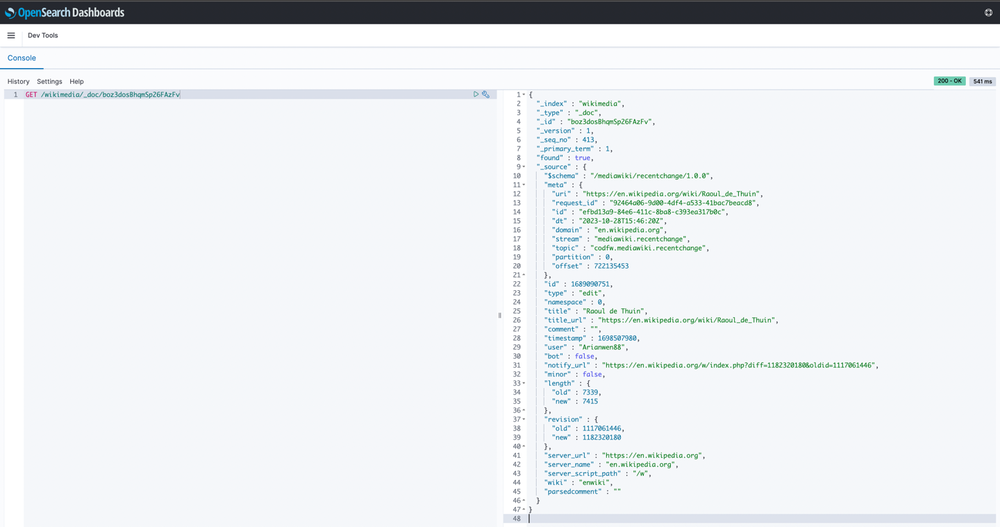
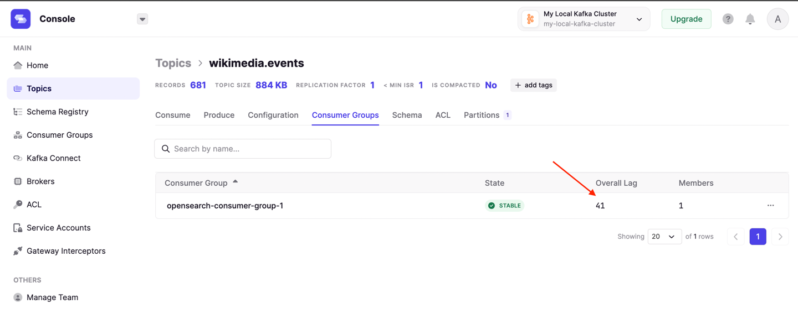

1) Up your containers
```
docker compose -f conduktor-platform/docker-compose.yml \
               -f kafka-consumer-opensearch/docker-compose.yml up
```
2) Start wikimedia producer
```
run psvm here -> java/kz/example/WikimediaChangesProducer.java 
```
3) Start consuming and sending to OpenSearch
```
run psvm here -> java/kz/example/OpenSearchConsumer.java
```
4) Test in opensearch console
```http request
GET /wikimedia/_doc/boz3dosBhqmSp26FAzFv
```
result:
```json
{
  "_index" : "wikimedia",
  "_type" : "_doc",
  "_id" : "boz3dosBhqmSp26FAzFv",
  "_version" : 1,
  "_seq_no" : 413,
  "_primary_term" : 1,
  "found" : true,
  "_source" : {
    "$schema" : "/mediawiki/recentchange/1.0.0",
    "meta" : {
      "uri" : "https://en.wikipedia.org/wiki/Raoul_de_Thuin",
      "request_id" : "92464a06-9d00-4df4-a533-41bac7beacd8",
      "id" : "efbd13a9-84e6-411c-8ba8-c393ea317b0c",
      "dt" : "2023-10-28T15:46:20Z",
      "domain" : "en.wikipedia.org",
      "stream" : "mediawiki.recentchange",
      "topic" : "codfw.mediawiki.recentchange",
      "partition" : 0,
      "offset" : 722135453
    },
    "id" : 1689090751,
    "type" : "edit",
    "namespace" : 0,
    "title" : "Raoul de Thuin",
    "title_url" : "https://en.wikipedia.org/wiki/Raoul_de_Thuin",
    "comment" : "",
    "timestamp" : 1698507980,
    "user" : "Arianwen88",
    "bot" : false,
    "notify_url" : "https://en.wikipedia.org/w/index.php?diff=1182320180&oldid=1117061446",
    "minor" : false,
    "length" : {
      "old" : 7339,
      "new" : 7415
    },
    "revision" : {
      "old" : 1117061446,
      "new" : 1182320180
    },
    "server_url" : "https://en.wikipedia.org",
    "server_name" : "en.wikipedia.org",
    "server_script_path" : "/w",
    "wiki" : "enwiki",
    "parsedcomment" : ""
  }
}
```



you also may send
```bash
npm install -g json
# then
curl localhost:9200/wikimedia/_doc/boz3dosBhqmSp26FAzFv | json
```

lag is increasing when only producer works




